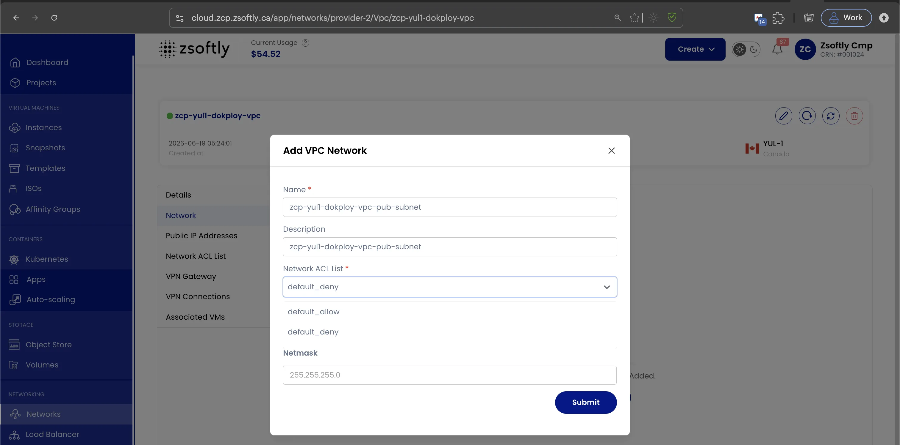
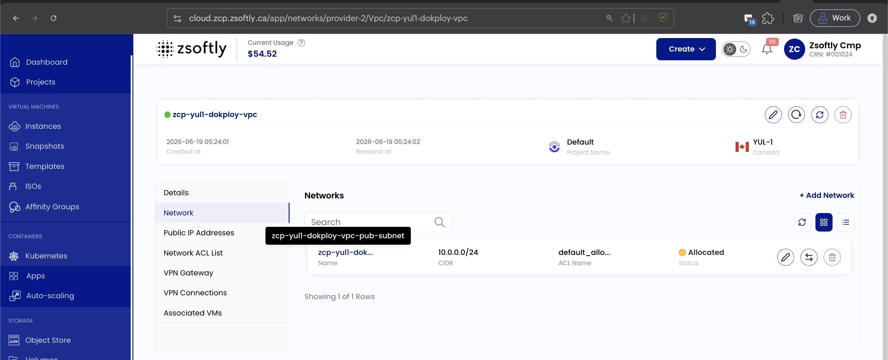

## Add Subnet

The Network tab displays all networks (subnets) created inside the VPC. Add new subnets as needed.

- Navigate to the **Network** tab inside your VPC.
- Click **Add Network**.

### Subnet fields

- **Name**: Identifier for the subnet.
- **Description**: Summary of the subnet's purpose.
- **Network**: Subnet CIDR block (e.g., `192.168.1.0/24`).
- **ACL**: Select a predefined ACL or create a new one to control inbound/outbound traffic.
- **Gateway**: The network gateway for routing traffic.
- **Network Mask**: Network mask for the subnet.

Click **Submit** to create the subnet.

The new subnet then appears under the **Network** tab with its CIDR, ACL, and allocation status.

See also: [Network ACLs](/public-cloud/networking/vpc/network-acls),
[VPC Overview](/public-cloud/networking/vpc/create-vpc)
