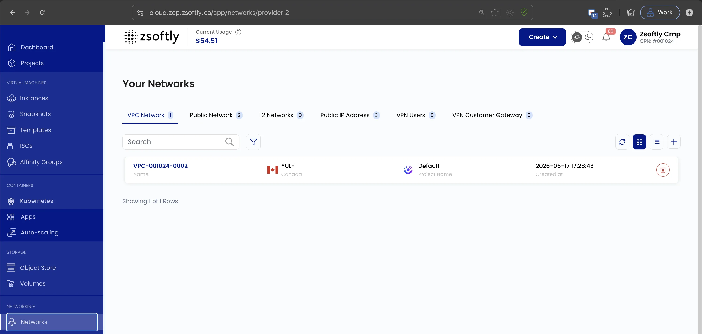
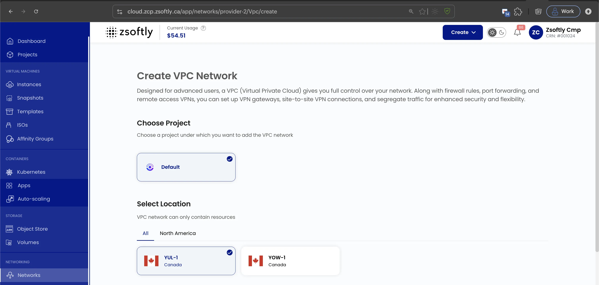
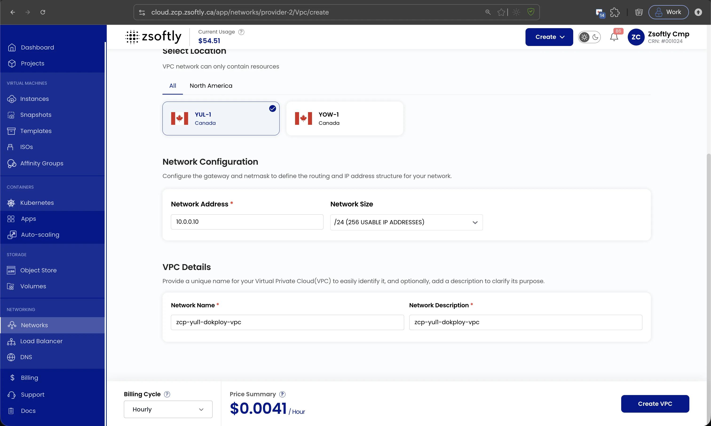
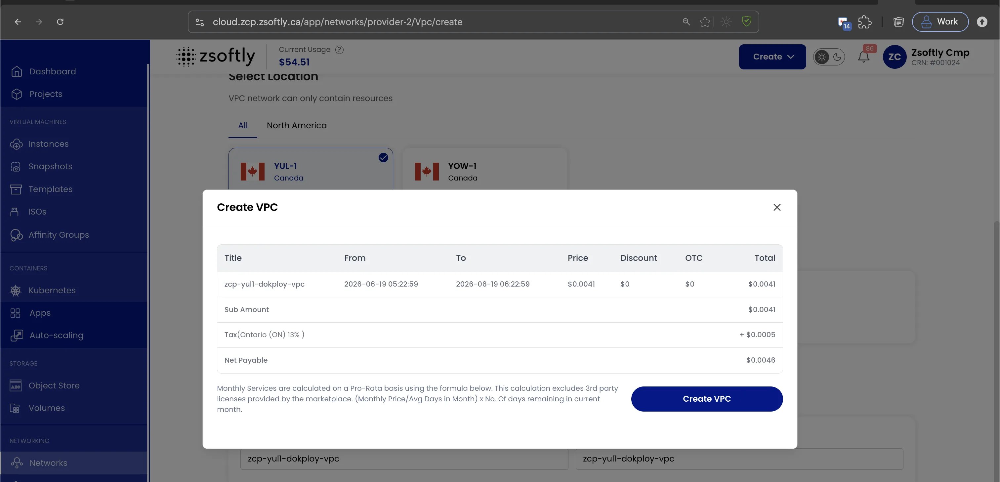
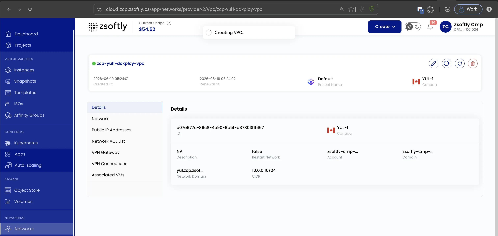

## Create VPC Network

A **Virtual Private Cloud (VPC)** network provides an isolated, secure environment for cloud
resources. It allows you to control traffic routing, IP addressing, subnets, and security within a
private network.

### Create a VPC

- From the left-hand menu, click **Networks** → **VPC Network** tab.
- Click the **+** icon to open the creation page.

### Assign to a Project and choose a Location

- Under **Choose Project**, select the project the VPC belongs to.
- Under **Select Location**, pick the data center region (for example `YUL-1` or `YOW-1`). A VPC and
  its resources live in a single region.

### Network configuration and name

- **Network Address** and **Network Size**: set the base address (for example `10.0.0.10`) and the
  subnet size (for example `/24`, 254 usable IP addresses) that define the VPC's IP range.
- **Network Name** and **Network Description**: give the VPC a unique, identifiable name.

### Create

- **Billing Cycles supported**: Hourly, Monthly, Quarterly, Semiannually, Yearly, Bi-annually,
  Tri-annually.
- **Billing rules supported**: Date to Date, Fixed Calendar Month, Unfixed Calendar Month, Fixed
  Prorata, Unfixed Prorata.
- Pick a **Billing Cycle**, review the **Price Summary**, and click **Create VPC**. A confirmation
  dialog shows the price breakdown (subtotal, tax, and net payable) before you confirm.

Once created, the VPC's **Details** tab shows its ID, region, network domain, and CIDR.

:::note

A VPC on its own has no usable subnet and cannot host a VM yet. Add at least one network (subnet)
inside it next.

:::

See also: [Add Subnet](/public-cloud/networking/vpc/add-subnet),
[Network ACLs](/public-cloud/networking/vpc/network-acls),
[VPN Gateway](/public-cloud/networking/vpc/site-vpn)
