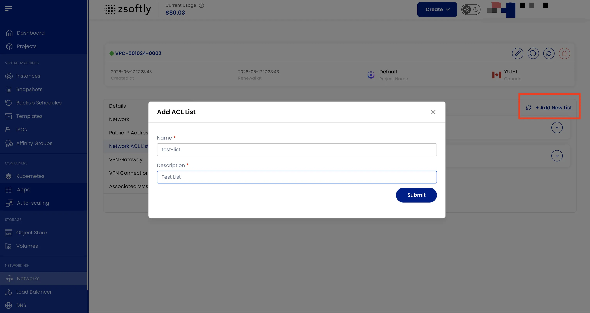

## Network ACL List

A **Network ACL** acts as a firewall that controls inbound and outbound traffic for subnets within
the VPC.

- The **Network ACL List** tab displays all ACLs configured in the VPC.
- Click **Add New List** to create a new ACL.
- Provide a **Name** and **Description**.
- Click **Submit**.

See also: [Add Subnet](/public-cloud/networking/vpc/add-subnet),
[Create VPC](/public-cloud/networking/vpc/create-vpc)
