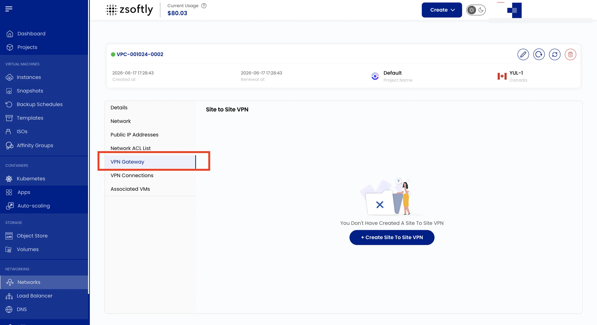
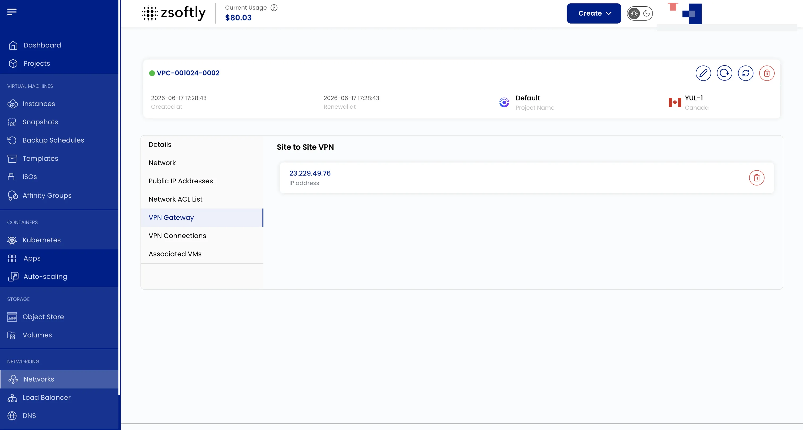

A **VPN Gateway** allows secure communication between your VPC and external networks, such as
on-premises data centers or other cloud networks.

- Navigate to the **VPN Gateway** tab to manage VPN Gateway connections.
- Supports Site-to-Site VPN connections.

### Create a Site-to-Site VPN Connection

- Navigate to the **VPN Connections** tab.
- Click **Create Site To Site VPN**.
- Select or create the **VPN Customer Gateway**.
- Check **Passive** if required, then click **Submit**.

See also: [VPC Overview](/public-cloud/networking/vpc/create-vpc),
[Network ACLs](/public-cloud/networking/vpc/network-acls),
[VPN Users](/public-cloud/networking/vpc/vpn-users)
