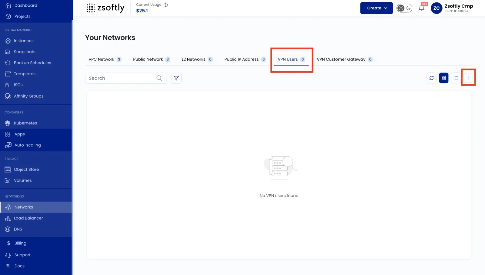

VPN Users allows you to manage client VPN access to your VPC network. This is separate from
Site-to-Site VPN and is used for individual user remote access.

- Navigate to your VPC network and go to the **VPN Users** tab.
- Click **Add VPN User** to create a new user.
- Provide the username and click **Submit**.
- Users download their VPN client configuration from the portal once created.

See also: [VPN Gateway](/public-cloud/networking/vpc/site-vpn),
[VPC Overview](/public-cloud/networking/vpc/create-vpc)
