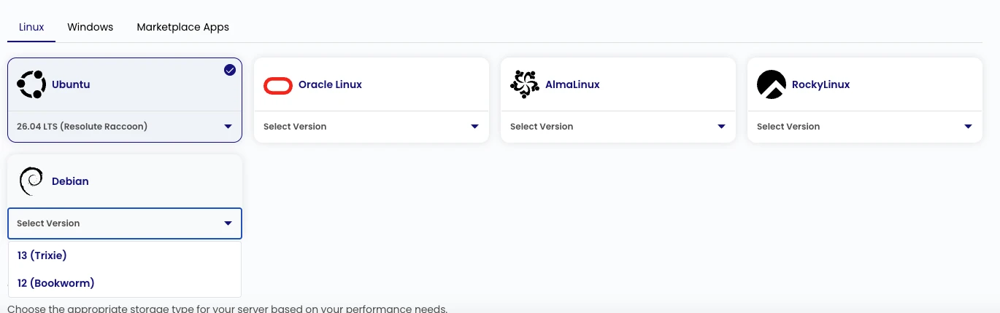

ZCP supports two Debian public images:

| Image       | Release       | Regions          | Default user |
| ----------- | ------------- | ---------------- | ------------ |
| `Debian-13` | 13 (Trixie)   | `yow-1`, `yul-1` | `debian`     |
| `Debian-12` | 12 (Bookworm) | `yow-1`, `yul-1` | `debian`     |

:::caution

YUL-1 is the primary production region. Use YOW-1 for development and testing; YOW-1 is not
recommended for production workloads. Availability is region-specific. Confirm the target region and
release in the portal before automating deployment. The portal is the final check if catalog
configuration and deployment state change at different times.

:::

## Requirements and Sizing

The smallest configured general-purpose plans provide a starting point for a basic Debian VM:

| Region  | Plan     | CPU    | Memory | Root storage | Storage tier |
| ------- | -------- | ------ | ------ | ------------ | ------------ |
| `yow-1` | `ci1.xs` | 1 vCPU | 1 GiB  | 40 GiB       | NVMe         |
| `yul-1` | `ca2.xs` | 1 vCPU | 1 GiB  | 40 GiB       | Pro-NVMe     |

The 40 GiB value comes from the current `ci1.xs` and `ca2.xs` plan definitions. It is the root-disk
baseline attached to those entry plans, not a Debian OS requirement. It leaves room for the base
image, package metadata, cloud-init work, logs, and normal system updates. Add capacity for
application packages, databases, monitoring agents, backups, and concurrency. Check the
[instance types](/public-cloud/compute/instance-types) and
[ZCP pricing page](https://zcp.zsoftly.ca/pricing) for current plan availability and pricing.

## Best Practices

- Pin the Debian release and region in infrastructure code.
- Use SSH keys and the `debian` account with least privilege. Do not share administrative
  credentials.
- Make cloud-init configuration idempotent and verify first-boot completion.
- Apply patches through Debian's official repositories.
- Configure firewall rules, backups or snapshots, monitoring, and disk-space alerts before exposing
  an application.
- Separate operating-system and application data when the workload, backup plan, or recovery process
  benefits from it.

## Official References

- [Debian Cloud](https://wiki.debian.org/Cloud)
- [Debian Cloud Image Lifecycle](https://wiki.debian.org/Cloud/ImageLifecycle)
- [Debian Official Images](https://wiki.debian.org/Teams/DPL/OfficialImages)
- [Debian Cloud Images](https://cloud.debian.org/images/cloud/)
- [cloud-init](https://cloud-init.io/)

## Supported Alternatives

Use an image listed in the current [OS image catalog](/public-cloud/operating-systems/):

- [Ubuntu](/public-cloud/operating-systems/ubuntu/): 26.04, 24.04, 22.04, or 20.04 LTS
- [Rocky Linux](/public-cloud/operating-systems/rocky-linux/): 9
- [AlmaLinux](/public-cloud/operating-systems/alma-linux/): 9
- [Oracle Linux](/public-cloud/operating-systems/oracle-linux/): 9
