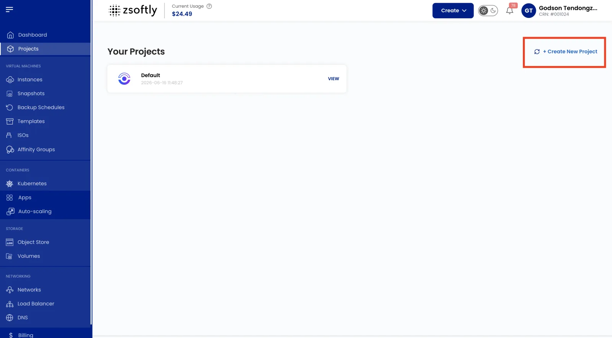
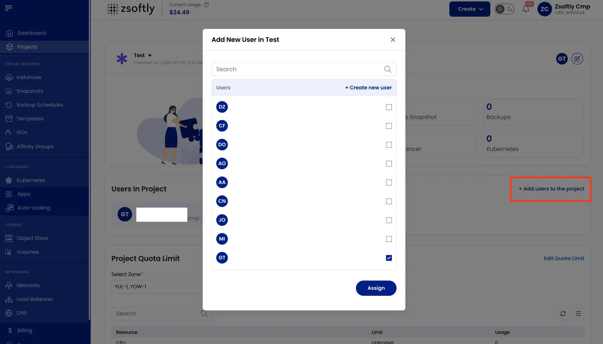
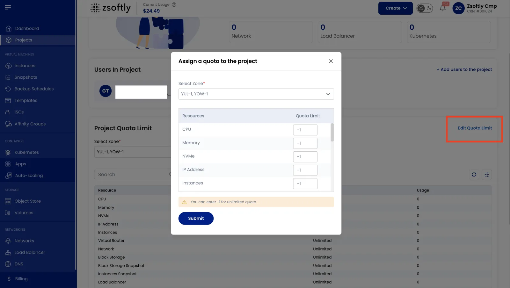

A **Project** is a workspace that groups related cloud resources (Compute Instances, networks,
volumes, snapshots, load balancers, and more) under a single, shared boundary. Instead of resources
living loosely under one account, a Project lets a team collaborate on a shared set of resources
with its own membership and its own resource quotas.

Projects are a foundational concept: almost every resource you create (an instance, a network, a
block storage volume) is assigned to a Project. If you've ever been asked to "**Choose the
Project**" while creating a resource, that selector points here. Every account starts with a default
Project. Create additional Projects to separate environments (e.g. `dev` vs `prd`), teams, or
clients.

## Why use Projects

- **Collaboration**: add teammates so everyone views and manages the same resources without sharing
  one login.
- **Separation**: keep workloads isolated. A `dev` Project and a `prd` Project hold completely
  separate instances, networks, and volumes.
- **Cost and quota control**: set per-Project resource limits (account limits) so one team or
  environment does not consume more than its allocation.
- **Organization**: view resource lists, usage, and billing per Project to see what each team or
  environment is running.

## Create a New Project

- From the left-hand menu, click **Projects**.
- Click **Create a New Project**.
- Enter the project details:
  - **Project Name**: a short, recognizable name (e.g. `team-platform-prd`).
  - **Project Description**: what the Project is for.
  - **Project Purpose**: the intended use or owning team.
- Click **Create Project**. The Project is created and becomes available in the **Project** selector
  when you create resources.

## Project Resources

Once a Project is created, its overview shows the resources associated with it. From here you can
see and manage everything the Project contains:

| Resource             | Description                                                               |
| -------------------- | ------------------------------------------------------------------------- |
| **Compute Instance** | Virtual servers for running applications or hosting websites.             |
| **VM Snapshot**      | Point-in-time capture of an instance's state and data.                    |
| **Backup**           | Managed backups that protect data and support business continuity.        |
| **Block Storage**    | Additional storage volumes attached to instances.                         |
| **Network**          | Public and private (VPC) networking that connects and isolates resources. |
| **Load Balancer**    | Distributes traffic across multiple instances for high availability.      |

When you create any of these resources, you select the Project they belong to. See
[Create a Compute Instance](../compute/create-instance) for an example of the Project selector in
action.

## Add Users to a Project

Invite teammates so they can collaborate on the Project's resources.

- Open the Project and click **Add Users to the Project**.
- Use the search bar to find the user you want to add.
- Click **Add** to include them in the Project.

The added user can now view and manage resources within this Project.

## Set Account Limits and Quotas

Account limits cap how much of each resource a Project can consume, per Location. Use them to
prevent runaway usage and to allocate capacity fairly across teams or environments.

- Open the Project and go to the **Project Account Limit** section. Here you can see the current
  limit and usage for each resource.
- Select the **Location** you want to set limits for.
- Click **Edit Account Limit** to open the **Assign a Quota to the Project** page.
- Choose the **Location** and the specific **Resource** whose quota you want to change.
- Enter the desired **Quota Limit**.

:::tip

Setting a quota limit to `-1` grants **unlimited** quota for that resource.

:::

- Click **Submit** to apply the new limit.

## Next steps

- [Create a Compute Instance](../compute/create-instance): deploy your first VM into a Project.
- [Quickstart](../getting-started/quickstart): go from zero to a running, reachable VM.
- [Networking](../networking/public-network/create): give your Project's resources connectivity.
