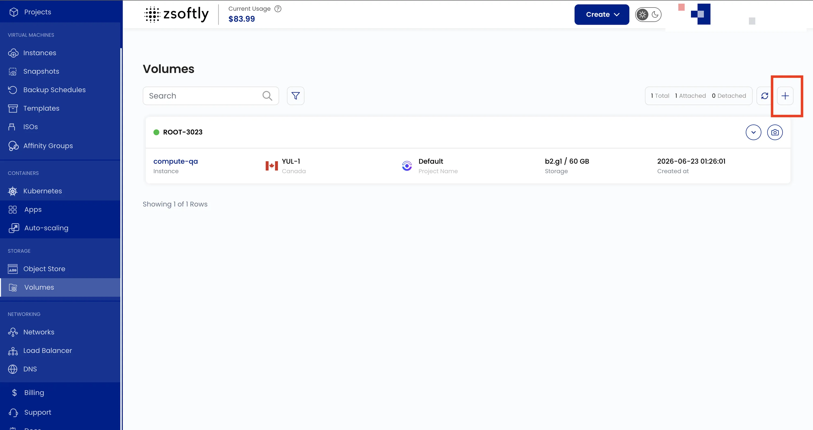
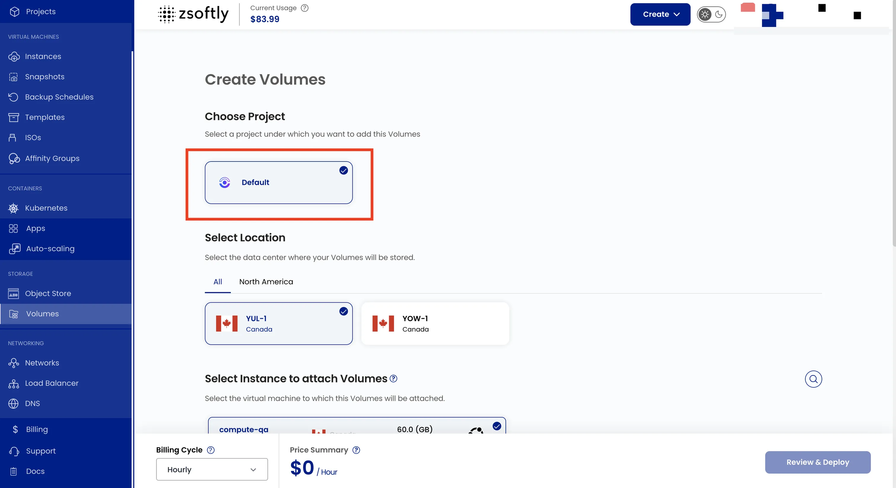
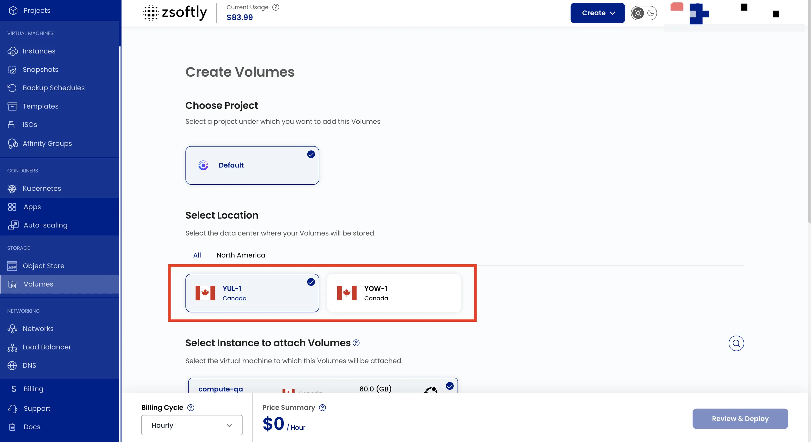
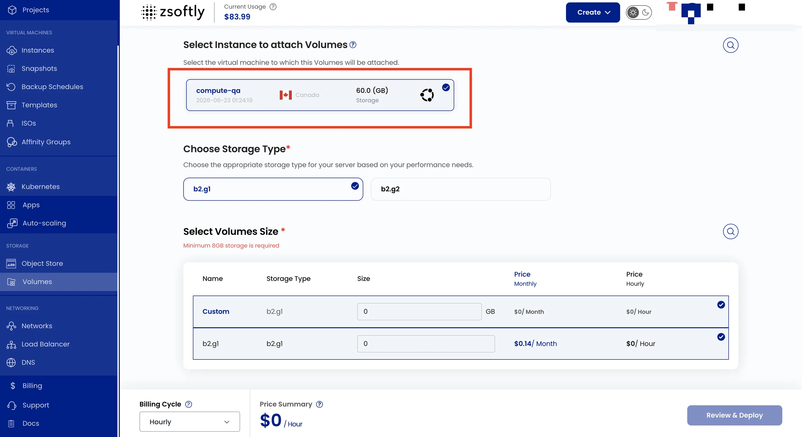
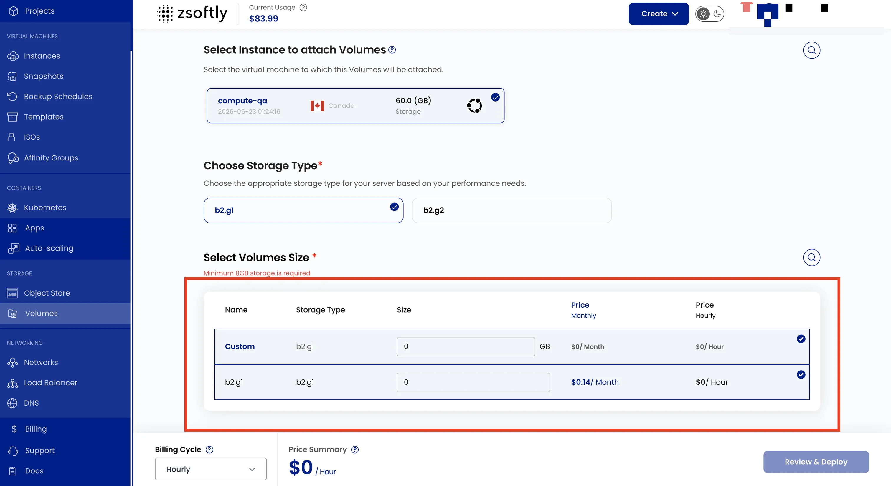
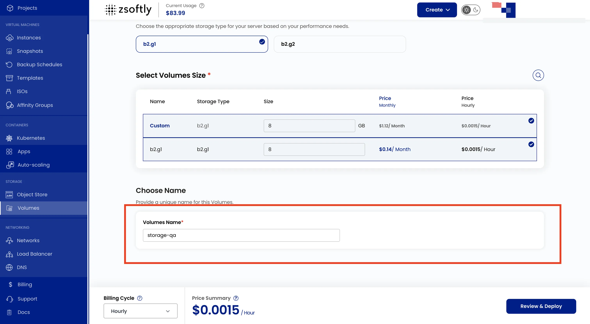
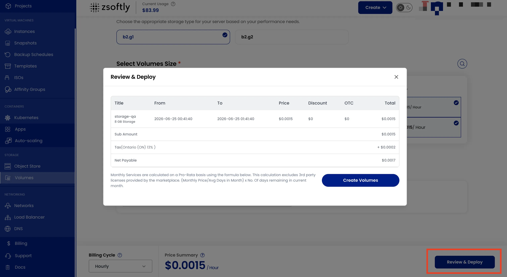

## Block Storage Volumes

Block storage volumes provide NVMe SSD storage that attaches to virtual machines. Once attached,
format and mount the volume to extend your VM's storage.

### Create a Block Storage Volume

- From the left-hand menu, click **Block Storages**.
- Click **Create Block Storage** or the **+** icon.



### Assign to a Project

Assign the volume to a project.



### Choose a Location

Select the data center location.



### Choose Instance

Select the VM instance to attach this volume to.



### Select Volume Size

Select storage type and size. Custom volumes are available.



### Name

Provide a unique Volume Name.



### Create

- **Billing Cycles**: Hourly, Monthly, Quarterly, Semiannually, Yearly, Bi-annually, Tri-annually.
- **Billing rules**: Date to Date, Fixed Calendar Month, Unfixed Calendar Month, Fixed Prorata,
  Unfixed Prorata.
- Review and click **Create Volume**.



After creation, format and mount the volume inside the VM:

```bash
# Find the new disk (usually /dev/vdb)
lsblk

# Format
sudo mkfs.ext4 /dev/vdb

# Mount
sudo mkdir -p /data
sudo mount /dev/vdb /data

# Persist across reboots
echo '/dev/vdb /data ext4 defaults 0 2' | sudo tee -a /etc/fstab
```

See also: [Volume Snapshots](/public-cloud/storage/block-storage/snapshots),
[VM Snapshots](/public-cloud/backups-snapshots/vm-snapshots)
