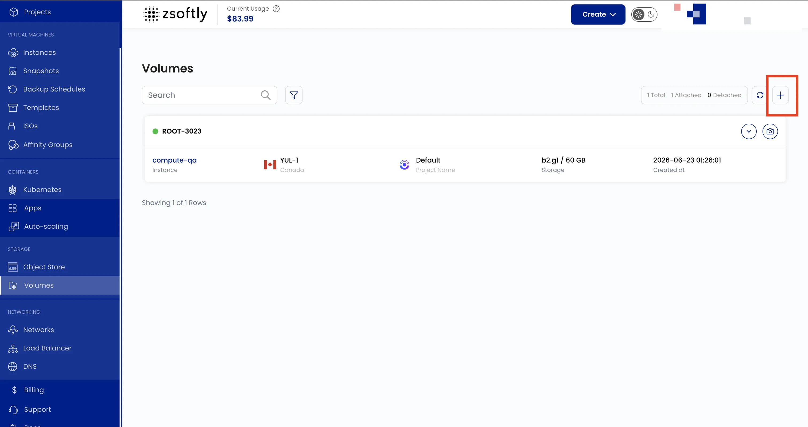
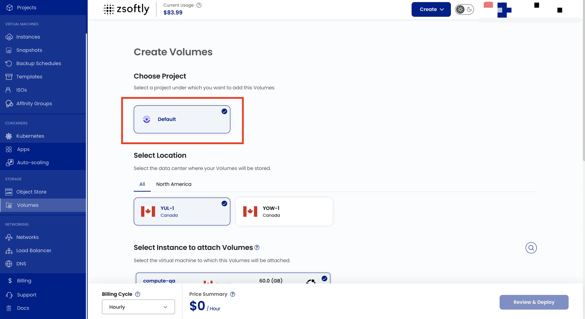
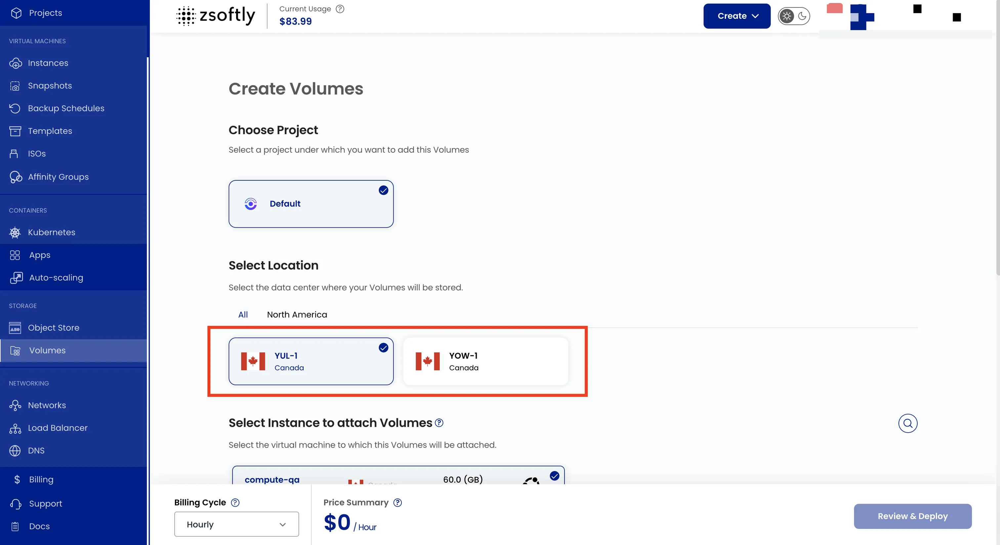
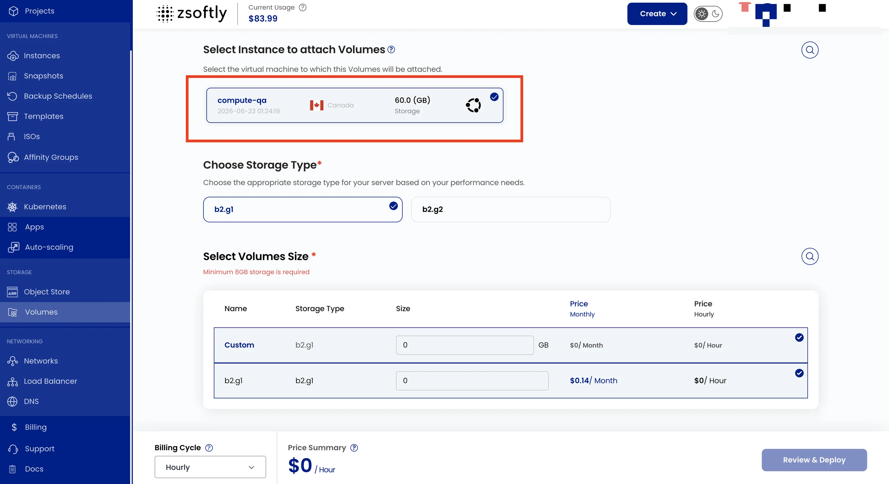
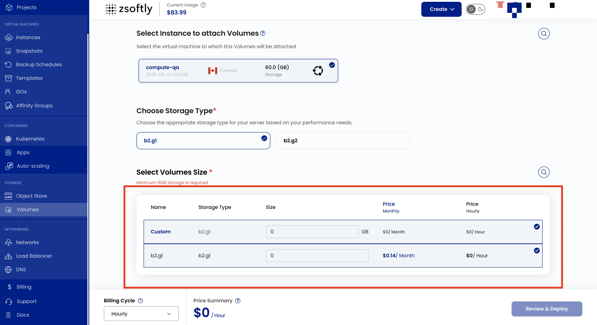
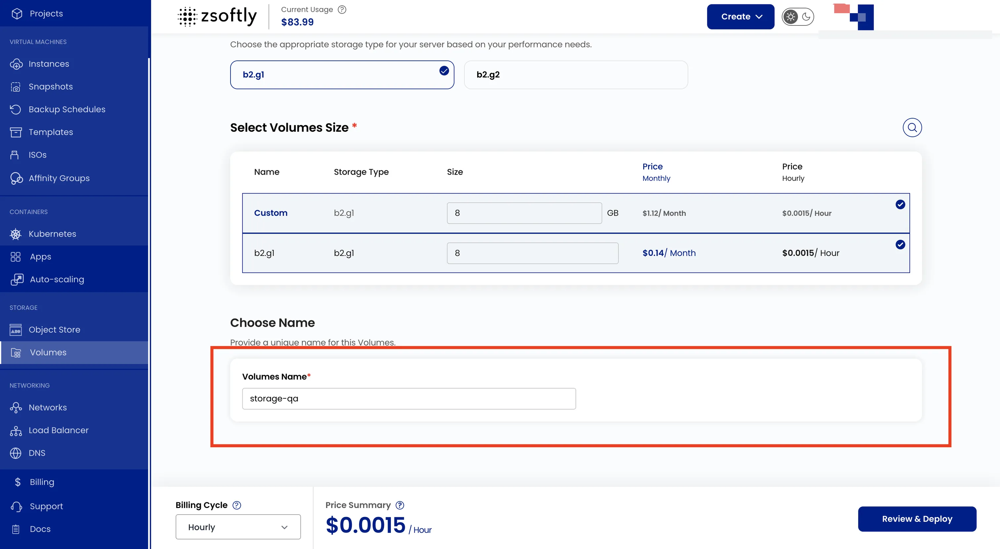
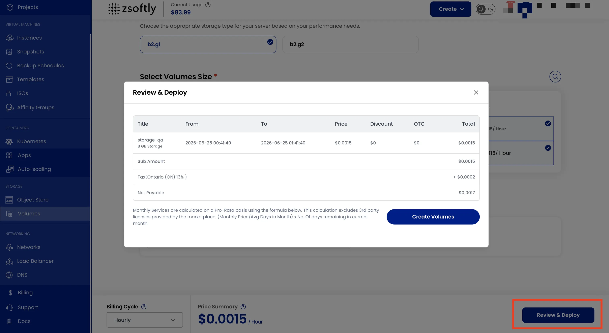

## Block Storage Volumes

Block storage volumes add persistent storage to virtual machines. They provide local NVMe SSD, local
SATA SSD, or replicated shared storage, depending on the selected region and plan. This page ends
after attachment verification. Follow
[Format and Mount a Volume](/public-cloud/storage/block-storage/format-and-mount) to format and
mount the new volume.

### Create Volumes

- From the left-hand menu, click **Volumes**.
- Click the **+** icon.

### Choose Project

Under **Choose Project**, assign the volume to a project.

### Select Location

Under **Select Location**, choose the data center location.

### Select Instance to attach Volumes

Under **Select Instance to attach Volumes**, choose the VM instance.

### Choose Storage Type and Select Volumes Size

Under **Choose Storage Type**, select a storage type. Under **Select Volumes Size**, select the
volume size. Custom volumes are available.

The published wizard screenshot shows the text `Minimum 8GB storage is required`. This screenshot is
for reference only. Use the current value shown for the selected storage plan in the portal.

### Choose Name

Under **Choose Name**, enter a unique **Volumes Name**.

### Create

Create and attach the volume to the target VM. Do not attach or detach disks while you format and
mount the volume.

- **Billing Cycle**: Hourly, Monthly, or Yearly.
- Click **Review & Deploy**, review the summary, then click **Create Volumes**.

The volume steps on this page end after attachment verification. Do not format a disk based only on
its device name or a manual selection. Continue at
[Confirm a Stable Volume Identifier](/public-cloud/storage/block-storage/format-and-mount#confirm-a-stable-volume-identifier).
If the selected volume cannot be confirmed through a stable guest identifier, stop and open
[Support](/troubleshooting#raise-a-support-ticket) with the project, location, exact error, and
non-sensitive resource details.

See also: [Storage Types and Resilience](/public-cloud/storage/block-storage/storage-types),
[Volume Snapshots](/public-cloud/storage/block-storage/snapshots),
[VM Snapshots](/public-cloud/backups-snapshots/vm-snapshots)
