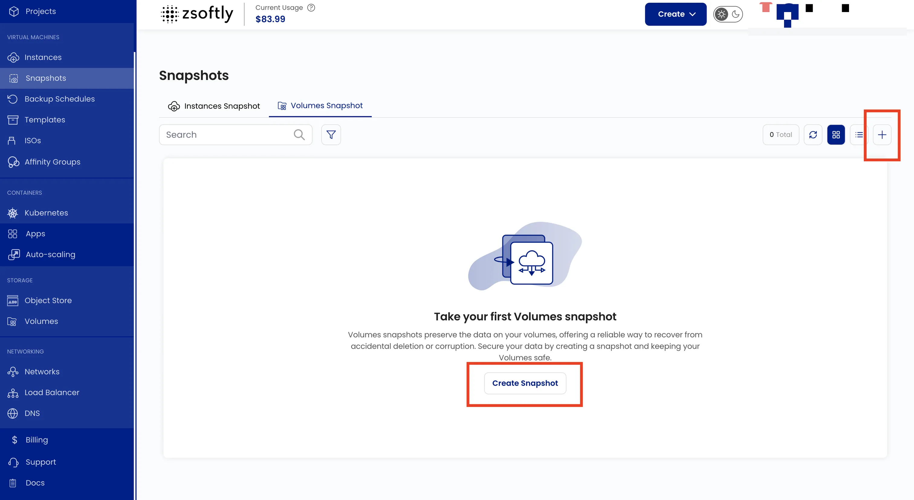
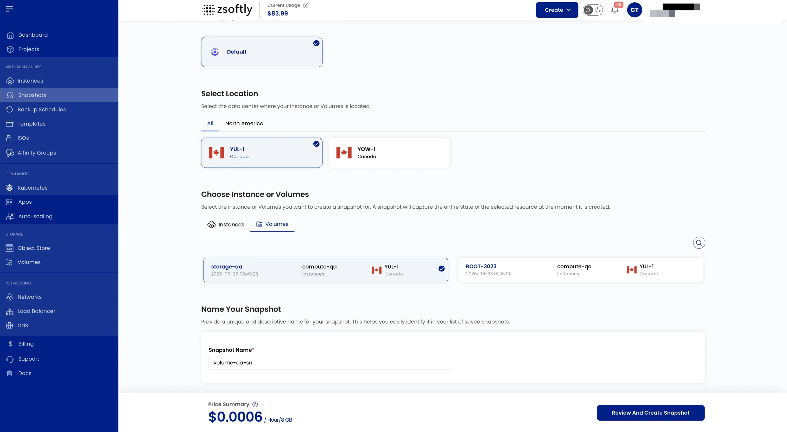

Volume Snapshots capture the current state of a block storage volume at a specific point in time.
Use them for backup and recovery from accidental deletion or corruption.

### Create a Volume Snapshot

- From the left-hand menu, click **Snapshots** → **Volume Snapshot** tab.
- Click **Take Snapshot** or the **+** icon.

### Steps

1. **Choose a Location**: select the data center.
2. **Assign to a Project**.
3. **Choose Block Storage**: select the volume to snapshot.
4. **Snapshot Name**: provide a unique name.
5. **Create**: Billing cycle: Hourly only. Billing rule: Fixed Prorata only. Click **Take
   Snapshot**.

See also: [Create Volume](/public-cloud/storage/block-storage/create-volume),
[VM Snapshots](/public-cloud/backups-snapshots/vm-snapshots)
