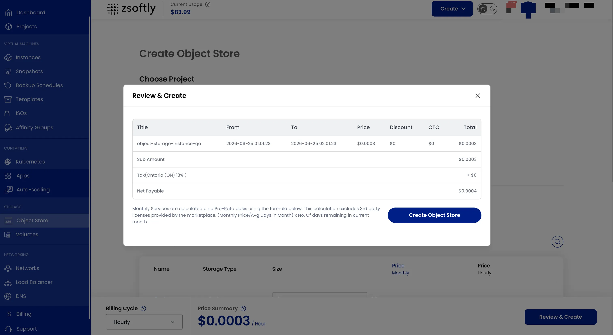
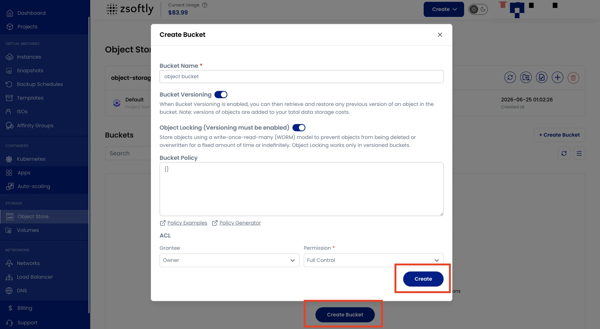
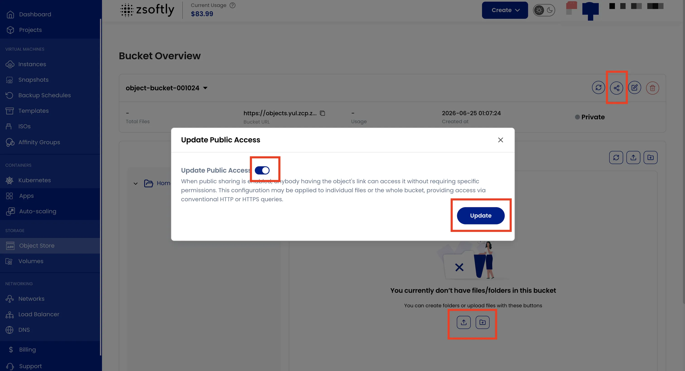

## Object Storage

ZSoftly Public Cloud object storage is S3-compatible. Use it for files, backups, static assets, or
any unstructured data.

### Create an Object Storage Instance

- From the left-hand menu, click **Object Storage**.
- Click **Create Object Storage** or the **+** icon.

### Steps

1. **Assign to a Project**.
2. **Choose a Location**.
3. **Object Storage Size**: choose storage type and size. Custom plans available.
4. **Name**: provide a unique name.
5. **Create**: Billing cycles: Hourly, Monthly, Quarterly, Semiannually, Yearly, Bi-annually,
   Tri-annually. Billing rules: Date to Date, Fixed Calendar Month, Unfixed Calendar Month, Fixed
   Prorata, Unfixed Prorata. Click **Review and Create**.

### Create a Bucket

Once your object storage instance is active:

- Click **Create Bucket**.
- Enter a **Bucket Name**.
- Optionally enable **Bucket Versioning** (required for Object Locking).
- Optionally enable **Object Locking**: stores objects in a write-once-read-many (WORM) model.

:::note

Object Locking only works in versioned buckets. Object versions count toward your total storage
costs.

:::

- Click **Create**.

### Manage Buckets

- **Share**: Enable public sharing so anyone with the object URL can access it.
- **Upload Files**: Upload files directly through the portal.
- **Create Folder**: Organize objects into folders within the bucket.

### Auto Scaling

Toggle auto-scaling on/off from the storage instance actions to automatically resize based on usage.

:::note

Screenshots coming.

:::

### Credentials

Click the **Credentials** icon to view your **S3 Access Key** and **Secret Key** for programmatic
access.

See also: [Access Keys](/public-cloud/storage/object-storage/access-keys),
[S3 Usage](/public-cloud/storage/object-storage/s3-usage)

:::tip

This is ZSoftly Public Cloud's **managed, multi-tenant** object storage. Need a **dedicated,
single-tenant storage cluster with root access** you administer yourself? See
[ZSoftly Cloud Storage](/cloud-storage/overview).

:::
