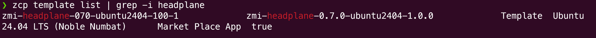
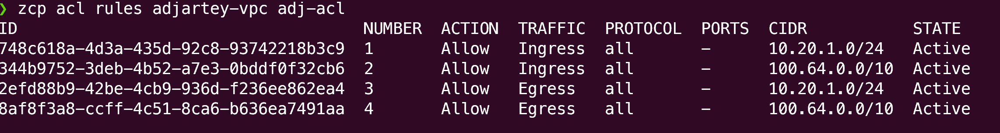
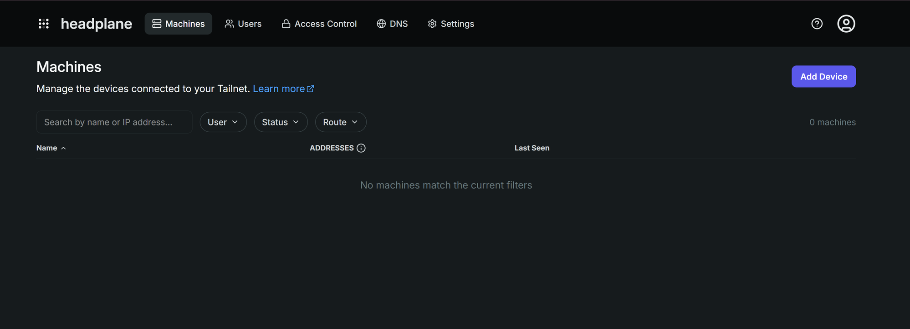
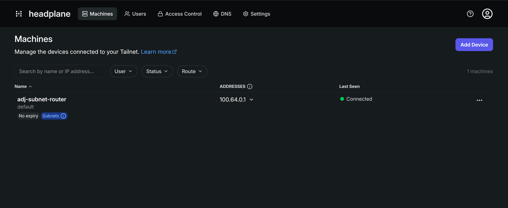
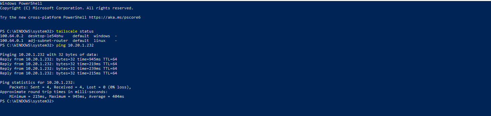
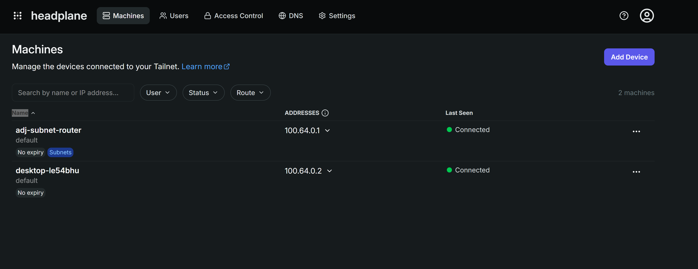

<!-- Depends on zsoftly/tools PR for zcp/build-private-network.sh and zcp/destroy-private-network.sh - do not merge this tutorial before that lands. -->

This tutorial builds a private network on ZCP: a VPC with a network tier that has no public exposure
by default, plus a self-hosted [Headscale](https://headscale.net) server that gives you
WireGuard-based mesh access into it. It's the foundation for the rest of this series: private
storage and private employee desktops both live inside the tier you build here, reachable only
through the mesh, never over a public IP.

By the end you have:

- A private VPC and network tier
- A custom network ACL locking that tier down to only the traffic it needs
- A self-hosted Headscale server, deployed from the Marketplace
- A subnet router bridging the public internet and the private tier
- Your own device connected to the mesh, reaching into the private tier

Plan for about 30 minutes.

:::note

The slugs in this tutorial (region `yul-1`, project `default-9`, plans, and so on) are **examples
from one account**. Yours will differ. Every step shows the `list` command that prints the right
value for your account and region. Always use those, don't copy the examples verbatim.

:::

## Before you start

- A ZSoftly Public Cloud account. [Sign up](/public-cloud/getting-started/account-signup) first if
  you do not have one.
- A terminal with an SSH client.
- `jq` installed. The build and teardown scripts in this tutorial require it (`apt install jq` or
  `brew install jq`).
- The [Tailscale client](https://tailscale.com/download) installed on your own machine, to prove
  connectivity at the end.

:::note

No domain or TLS certificate is required. The Headplane template runs over plain HTTP by default,
and that's the baseline this tutorial uses. Encryption for the admin UI comes from an SSH tunnel
instead of TLS, not from skipping encryption entirely. See "What the script builds" below.

:::

## Step 1: Install the CLI

```bash
# macOS and Linux
curl -fsSL https://raw.githubusercontent.com/zsoftly/zcp-cli/main/scripts/install.sh | bash
```

```powershell
# Windows (PowerShell)
irm https://raw.githubusercontent.com/zsoftly/zcp-cli/main/scripts/install.ps1 | iex
```

Confirm it works with `zcp version`.

## Step 2: Authenticate

1. In the portal, open **Profile → API Tokens** and create a token. Copy it.
2. Create a CLI profile and answer its prompts:

```bash
zcp profile add default
```

It prompts for the **Bearer token** you copied, then a **default region** and **default project**
(see the note below to look those up first if you don't already know them). There's no API URL
prompt. That's a fixed default unless you override it with `--api-url-override`. Then verify:

```bash
zcp auth validate
```

:::note

Every command that touches a region-specific resource needs a **region** and a **project**. The
profile you just created already carries defaults from the prompts above. Look them up first if you
don't know them yet:

```bash
zcp region list                # find your region, e.g. yul-1
zcp project list                # find your project slug, e.g. default-9
```

Override the profile's defaults for one command with `--region`/`--project` flags, or for the rest
of your shell session with `export ZCP_REGION=...`/`export ZCP_PROJECT=...`.

:::

## Step 3: Find your resources

Find the Headplane template (it bundles the Headscale control server and a web UI):

```bash
zcp template list | grep -i headplane
```



Note the **SLUG** (for example `zmi-headplane-070-ubuntu2404-100-1`). Template slugs vary by region
and version.

You also need a **compute plan**, a **network plan**, a **VPC router plan**, and a **storage
category**:

```bash
zcp plan vm            # compute plans, e.g. ca2sm
zcp plan network        # network plans, e.g. pnet-yul
zcp plan router          # VPC router plan, e.g. virtual-private-cloud-vpc-1
zcp storage-category list  # e.g. pro-nvme, ssd-storage, premium-ssd
```

## Step 4: Add your SSH key

```bash
ssh-keygen -t ed25519 -C "you@example.com"   # skip if you already have one

zcp ssh-key import --name my-key --key-file ~/.ssh/id_ed25519.pub

zcp ssh-key list
```

:::note

The key name must be 20 characters or fewer, and the public key itself must be unique on your
account.

:::

## Run the script

Building the VPC, private tier, ACL, Headplane, and subnet router is one script:
`zcp/build-private-network.sh` from the [zsoftly/tools](https://github.com/zsoftly/tools)
repository. It runs through the same phases explained in the next section, in order, and prints each
resource as it creates it.

:::note

This script and the teardown script further down need a bash shell. That's native on macOS and
Linux. On Windows, run it from WSL or Git Bash.

:::

```bash
bash <(curl -fsSL https://raw.githubusercontent.com/zsoftly/tools/main/zcp/build-private-network.sh) \
  --ssh-key my-key --name my-workspace
```

The script picks up `ZCP_REGION` and `ZCP_PROJECT` from your shell if you exported them in Step 2.
Pass `--region`/`--project` instead if you didn't.

| Flag        | Purpose                                   | Default / requirement      |
| ----------- | ----------------------------------------- | -------------------------- |
| `--ssh-key` | Key name from Step 4, used for both VMs   | Required                   |
| `--name`    | Prefix for every resource name it creates | `workspace`                |
| `--region`  | zcp region slug                           | Required (flag or env var) |
| `--project` | zcp project slug                          | Required (flag or env var) |

The Headplane template, both compute plans, the network plan, the VPC router plan, and both storage
categories are auto-discovered from your account. The script prints what it picked at the top of its
own output, so you can see the choice before anything is created.

The subnet router template isn't looked up. It defaults to a fixed slug (`ubuntu-2404-lts-1`). Pass
`--router-template` if your account doesn't have that template. Your public IP (`--my-ip`), the VPC
network base (`--network-address`), and the billing cycle (`--billing-cycle`) aren't account lookups
either. They default to an auto-detected or fixed value that you can override.

Pass any flag explicitly to pin a specific value instead. Run the script with `--help` for the full
list.

```text
==> Preflight checks
[OK] zcp CLI authenticated, region=yul-1 project=default-9
[INFO] Detecting your public IP...
[INFO] Admin-port access scoped to: <your-ip>/32
[INFO] Resolved resources:
    Headplane template : zmi-headplane-070-ubuntu2404-100-1
    Headplane plan      : ci2ls
    Router template      : ubuntu-2404-lts-1
    Router plan            : ci2ls
    Network plan            : pnet-yul
    VPC router plan          : virtual-private-cloud-vpc-1
    VPC storage category      : pro-nvme
    VM storage category        : pro-nvme
```

The script takes several minutes. It waits for both VMs to boot, waits for Headplane's first-boot
provisioning to finish, and waits for SSH before configuring anything over it.

## What the script builds

### VPC and private tier

**The private tier itself has no public IP. Only Headplane gets an internet-facing application
port.**

The script creates a VPC (`my-workspace`) and a network tier inside it (`my-workspace-tier`), with
no public IP on the tier itself. Both VMs the script deploys get their own public IP, needed to
reach Headscale and for the script to configure them over SSH. Headplane is the only one of the two
with an internet-facing application port, opened deliberately through firewall and port-forward
rules.

:::note

ZCP gives the VPC a source-NAT IP for outbound traffic automatically at creation. The script doesn't
allocate one itself, and you shouldn't either with `zcp ip allocate`. Doing so creates a redundant,
billable extra IP. If it happens, `zcp ip release <slug>` cleans it up.

:::

### The custom network ACL

**The ACL makes the tier private, not the VPC by itself.**

The tier's default ACL permits everything. The script replaces it with one that only allows what the
tier needs, then applies that ACL to the tier. A VPC alone doesn't guarantee isolation, the ACL
does.

:::note

The second CIDR the script allows, `100.64.0.0/10`, is Headscale's mesh address range. This isn't
something looked up after Headplane exists. It's Tailscale and Headscale's documented default IP
range for every device on the mesh ([RFC 6598](https://www.rfc-editor.org/rfc/rfc6598), the "Shared
Address Space" block). Every default install uses it, unless someone deliberately reconfigures it.
The script can add these rules before Headplane is deployed, because the range itself doesn't depend
on anything else it builds.

:::

:::caution

Allowing only the tier's own CIDR (`10.20.1.0/24`) is not enough. Reaching the subnet router's own
tier IP through the mesh works with just that rule, because that traffic terminates directly at the
router's WireGuard tunnel endpoint, before the tier ACL is evaluated.

Traffic to any _other_ VM on the tier is forwarded by the router first. We confirmed directly with a
packet capture that Tailscale's default source NAT rewrites this forwarded traffic to the router's
own tier address, not the original mesh client's address. The mesh-CIDR rule (ingress and egress)
stays in this ACL because an earlier live test found reaching other tier VMs fails without it.
Egress rules are required too, since this platform's network ACLs are stateless: an ingress-only
rule doesn't cover return traffic.

:::

Verify the rules landed (see `zcp acl rules` under Inspect what was created, below):



### Headplane

**Headplane opens exactly one application port to the internet, deliberately: the mesh control
endpoint. The admin UI never touches the public internet at all.**

The script deploys the Headplane marketplace template (it bundles the Headscale control server and a
web UI) on its own public network.

By default, the template's first-boot script points the Headscale configuration at the VM's
**private** IP. External devices need the public IP instead, so the script SSHes in, rewrites that
config, and restarts the stack.

The script opens port **8080** (Headscale's mesh control endpoint) on the firewall and creates the
matching port-forward rule. A firewall rule alone permits traffic at the network level. On this kind
of network it does not get you reachability by itself. A port-forward rule maps the public IP's port
to the VM's private IP. Both are required. 8080 has to stay open broadly (`0.0.0.0/0`): any remote
device that will ever join the mesh needs to reach it from wherever it is, by design.

:::caution

Port **3000**, the admin UI, is never opened on the firewall at all, not even scoped to your own IP.
The API key it protects controls the entire mesh: minting preauth keys, approving routes, seeing
every connected device. Sending that key over plain HTTP on a public port is a real credential-theft
risk, not a theoretical one, so the script never exposes it that way. Reach it only through an SSH
tunnel over the port 22 rule already in place:

```bash
ssh -L 3000:localhost:3000 ubuntu@<headplane-public-ip>
```

Leave that connected, then open `http://localhost:3000/admin/login` in your own browser. The
script's final summary prints this exact command with your real IP filled in.

:::

:::caution

Marketplace App templates like this one get a default SSH firewall rule at deploy time, open to
**any address** (`0.0.0.0/0`, both TCP and UDP port 22), an explicit rule visible in
`zcp firewall list`. Not something you created, and not scoped to you. The script finds and deletes
it, then adds a replacement scoped to your own IP.

This is specific to Marketplace App templates. The subnet router, deployed from a plain OS image,
never gets this default rule, so this lockdown step only applies to Headplane.

:::

First boot on the Headplane VM generates a unique cookie secret, starts the stack, creates a default
Headscale user, and mints an API key, written to `/etc/headplane/credentials.txt` on the VM. The
script reads it over SSH and prints it in its final summary. That's a one-time read by convention,
not a technical limit: if you need the key again later, SSH in and read
`/etc/headplane/credentials.txt` directly.

:::note

If the Headplane UI rejects this key ("API key was not found in the Headscale database"), mint a
fresh one directly on the VM and use that instead:

```bash
sudo docker exec headscale headscale apikeys create --expiration 90d
```

:::

With the tunnel open, sign in at `http://localhost:3000/admin/login` with the API key.



### The subnet router

**The subnet router is the only path between the internet and the private tier.**

The script deploys a small VM with two network interfaces: its own public network, to reach
Headscale for registration, plus the private tier, attached after creation.

The platform hot-adds the second network interface, but the operating system doesn't bring it up
automatically. The script writes a netplan file for the new interface and applies it, then reads
back the address the tier's DHCP assigned.

It installs the Tailscale client on the router (the same client Headscale uses, pointed at a custom
control server) and enables IP forwarding **before** registering. `tailscale up` prints a warning
about this ("IP forwarding is disabled, subnet routing/exit nodes will not work"). It does not block
on it. Skip this step and you end up with a route that's approved but never forwards traffic.

The script mints a preauth key on the Headplane server and uses it to register the router,
advertising the tier's CIDR as a route.

:::note

Registering needs the numeric Headscale user ID, not the username string. `--user default` fails
with a parse error. You may also see a warning about "UDP GRO forwarding" being suboptimally
configured. That's a performance tuning suggestion, not an error, and it doesn't block registration.

:::

Approving an advertised route on the Headscale side is not automatic, so the script does this for
you: it looks up the router's node ID and approves the tier CIDR against it. Without that approval,
`list-routes` shows the route as **Available** but never **Approved** or **Serving**. It can take a
few seconds for **Serving (Primary)** to catch up even after approval. That's normal.

You can also see this from the Headplane UI: the router shows **Connected** with a **Subnets** badge
once it's advertising the route.



This VM is the door into the private tier. Later tutorials' desktops and storage sit behind it
without needing their own public IPs.

## Inspect what was created

Everything the script built is a normal ZCP resource. List it the same way you'd list anything else:

```bash
zcp vpc list
zcp network list
zcp instance list
zcp acl rules my-workspace my-workspace-acl
```

```text
ID                                    NAME               STATE    PRIVATE IP  PUBLIC IP        REGION
a1b2c3d4-...                          my-workspace-headscale       Running  10.0.0.214  198.51.100.10   YUL-1
e5f6a7b8-...                          my-workspace-subnet-router   Running  10.0.0.76   198.51.100.11   YUL-1
```

## Connect from your own machine

The build script's own final summary already mints a fresh preauth key for your device. It prints a
ready one-liner that installs Tailscale, if it isn't already installed, and registers it against
your Headscale server in one step. This is the same `vpn/install.sh` script used for onboarding any
other endpoint. Copy that line from your terminal output. It looks like this (key genericized, yours
is a real value):

```bash
HEADSCALE_URL="http://198.51.100.10:8080" \
  bash <(curl -fsSL https://raw.githubusercontent.com/zsoftly/tools/main/vpn/install.sh) "your-name" --key "hskey-auth-EXAMPLE..."
```

Paste it into a terminal on your own machine and run it. On macOS you may need to approve a network
extension once in **System Settings → Privacy & Security** before it finishes connecting. On Windows
without WSL or Git Bash, use `vpn/install.ps1` from the same `zsoftly/tools` repository instead. The
PowerShell invocation pattern is in that repo's README.

Verify:

```bash
tailscale status
ping <router-tier-ip>
```





Direct, same-region connections typically respond in a few milliseconds. A connection relayed
through a DERP server (common across distant networks) can take several hundred milliseconds,
especially on the first packet while the path negotiates. Both are normal. Network path affects
latency far more than VM size does.

:::caution

If a node shows **offline** in `tailscale status`, with a health check message about being unable to
reach the coordination server, restart `tailscaled` on the affected node. This can happen even when
nothing about the network setup is wrong:

```bash
sudo systemctl restart tailscaled
```

This has been observed on both the subnet router and plain clients.

:::

## Verify isolation

Reaching the subnet router's own tier IP in the previous section proves the router itself has no
public exposure. It does not prove the tier as a whole is isolated: that traffic terminates directly
at the router's WireGuard endpoint, which is a different path than reaching any _other_ VM on the
tier through the router's forwarding.

For real proof, repeat Step 8's `zcp instance create` + `add-network` pattern for a second VM on the
tier (skip the Tailscale steps, this one doesn't need them). From your already-connected device:

```bash
ping <second-vm-tier-ip>
```

That succeeds, through the mesh and the router's forwarding, not just to the router's own address.
Now try reaching the same IP from anywhere that never joined the mesh: your own home network, a
different machine, anywhere on the public internet. It fails, every time. That address is private,
with no public IP and no port-forward rule anywhere in this design. It was never internet-reachable
in the first place, mesh or no mesh, which is the actual proof of isolation, not the mesh being what
blocks it.

Delete the second VM when you're done (`zcp instance delete <name>`). It's not part of the working
setup, just a way to see this for yourself.

## Clean up

Hourly billing runs while resources exist. The teardown script removes the subnet router, the
Headplane VM, and the VPC (which removes the tier automatically) for a given `--name` prefix.

```bash
bash <(curl -fsSL https://raw.githubusercontent.com/zsoftly/tools/main/zcp/destroy-private-network.sh) \
  --name my-workspace
```

It picks up `ZCP_REGION`/`ZCP_PROJECT` from your shell the same way the build script does. Pass
`--region`/`--project` instead if you didn't export them.

:::caution

This does not always remove everything on its own. Each VM's deploy implicitly creates its own
standalone network, separate from the VPC and tier, and deleting the VM never removes that network
or the source-NAT IP pinned to it. The script detects this and warns you with the network's ID, but
it cannot delete it automatically. There's no `zcp` command that resolves that ID to something
deletable. Before you consider cleanup done, check the script's output for this warning, and if it
appears, remove the flagged network from the CMP web portal (search by the network ID it prints).
Confirm nothing billable is left with `zcp instance list` and `zcp vpc list`.

:::

## Recap

1. Install the CLI, authenticate, find your account's resource slugs, and import an SSH key (Steps
   1-4).
2. Run `build-private-network.sh --ssh-key <name> --name my-workspace`. It creates the VPC, private
   tier, locked-down ACL, Headplane, and subnet router, then prints a connect command for your own
   device.
3. Copy that command from the script's output, run it on your own machine, then verify with
   `tailscale status` and a ping into the tier.
4. Run `destroy-private-network.sh --name <prefix>` when you're done, to remove everything and stop
   billing.

## Next steps

The next parts of this series (private shared storage, then Ubuntu employee desktops, both reusing
the tier and mesh you built) are still in progress. In the meantime:

- [CLI reference](/public-cloud/cli/reference): every command and flag
- [Tutorials overview](/tutorials): the full list of available tutorials
