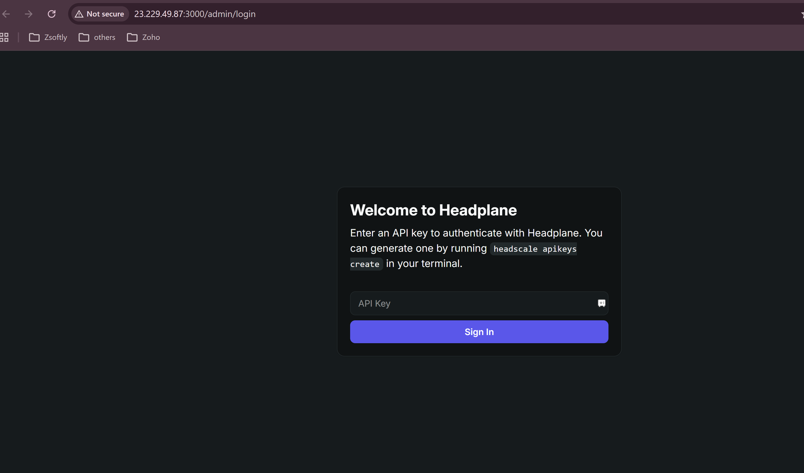
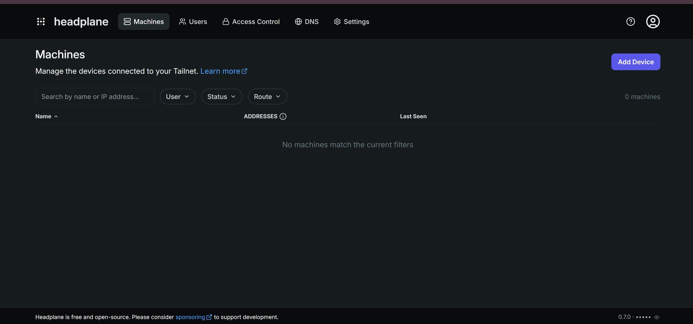
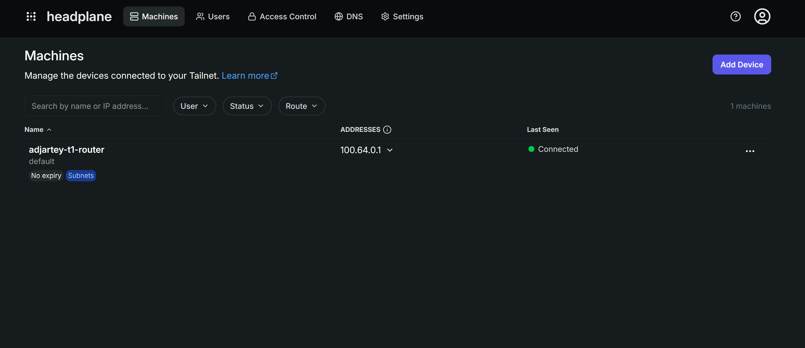
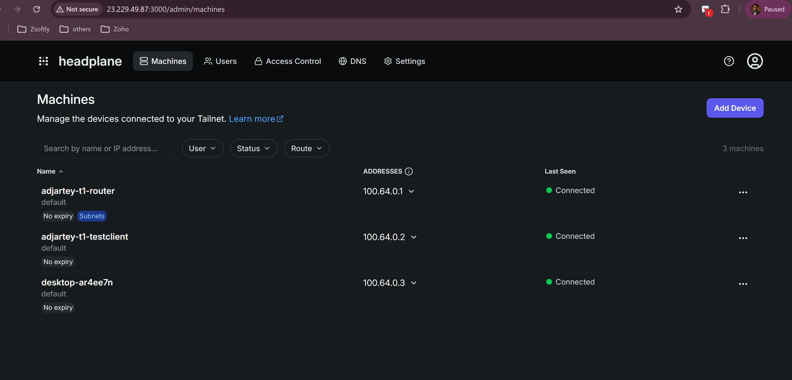
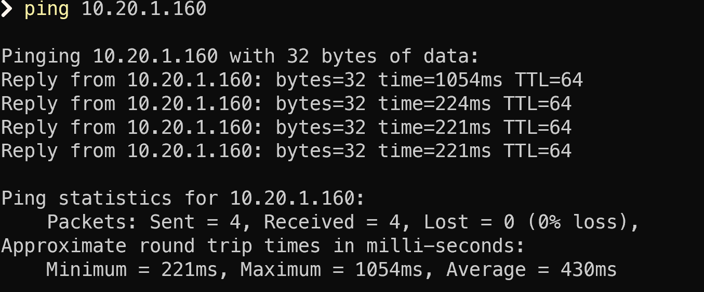

This tutorial builds a private network on ZCP: a VPC with a network tier that has no public exposure
by default, plus a self-hosted [Headscale](https://headscale.net) server that gives you
WireGuard-based mesh access into it. It's the foundation for the rest of this series: private
storage and private employee desktops both live inside the tier you build here, reachable only
through the mesh, never over a public IP.

By the end you have:

- A private VPC and network tier
- A custom network ACL locking that tier down to only the traffic it needs
- A self-hosted Headscale server, deployed from the Marketplace
- A subnet router bridging the public internet and the private tier
- Your own device connected to the mesh, reaching into the private tier

Plan for about 30 minutes.

:::note

The slugs in this tutorial (region `yul-1`, project `default-9`, plans, and so on) are **examples
from one account**. Yours will differ. Every step shows the `list` command that prints the right
value for your account and region. Always use those, don't copy the examples verbatim.

:::

## Before you start

- A ZSoftly Public Cloud account. [Sign up](/public-cloud/getting-started/account-signup) first if
  you do not have one.
- A terminal with an SSH client.
- The [Tailscale client](https://tailscale.com/download) installed on your own machine, to prove
  connectivity at the end.

:::note

No domain or TLS certificate is required. The Headplane template runs over plain HTTP by default,
and that's the baseline this tutorial uses.

:::

## Step 1: Install the CLI

```bash
# macOS and Linux
curl -fsSL https://raw.githubusercontent.com/zsoftly/zcp-cli/main/scripts/install.sh | bash
```

```powershell
# Windows (PowerShell)
irm https://raw.githubusercontent.com/zsoftly/zcp-cli/main/scripts/install.ps1 | iex
```

Confirm it works with `zcp version`.

## Step 2: Authenticate

1. In the portal, open **Profile → API Tokens** and create a token. Copy it.
2. Create a CLI profile and paste the token when prompted:

```bash
zcp profile add default
```

You are prompted for the **Bearer token** and the **API URL** (`https://api.zcp.zsoftly.ca/api`).
Then verify:

```bash
zcp auth validate
```

:::note

Every command that touches a region-specific resource requires a **region** and a **project**. Set
them once so you don't repeat the flags:

```bash
zcp region list                # find your region, e.g. yul-1
zcp project list                # find your project slug, e.g. default-9

export ZCP_REGION=yul-1
export ZCP_PROJECT=default-9
```

:::

## Step 3: Find your resources

Find the Headplane template (it bundles the Headscale control server and a web UI):

```bash
zcp template list | grep -i headplane
```

Note the **SLUG** (for example `zmi-headplane-070-ubuntu2404-100-1`). Template slugs vary by region
and version.

You also need a **compute plan**, a **network plan**, a **VPC router plan**, and a **storage
category**:

```bash
zcp plan vm            # compute plans, e.g. ca2sm
zcp plan network        # network plans, e.g. pnet-yul
zcp plan router          # VPC router plan, e.g. virtual-private-cloud-vpc-1
zcp storage-category list  # e.g. pro-nvme, ssd-storage, premium-ssd
```

## Step 4: Add your SSH key

```bash
ssh-keygen -t ed25519 -C "you@example.com"   # skip if you already have one

zcp ssh-key import --name my-key --key-file ~/.ssh/id_ed25519.pub

zcp ssh-key list
```

:::note

The key name must be 20 characters or fewer, and the public key itself must be unique on your
account.

:::

## Step 5: Create the VPC and a private tier

```bash
zcp vpc create --name my-workspace --plan virtual-private-cloud-vpc-1 \
  --network-address 10.20.0.0 --size 16 --billing-cycle hourly \
  --storage-category pro-nvme
```

:::note

Use the actual network base for `--network-address` (for example `10.20.0.0`, not `10.20.0.1`).
Passing a host address instead of the base still works, but the CLI prints a warning and records the
CIDR oddly.

:::

```bash
zcp network create --name workspace-tier --vpc my-workspace \
  --gateway 10.20.1.1 --netmask 255.255.255.0 --billing-cycle hourly
```

The tier gets no public IP by default. Only the Headscale server (Step 7) gets a public-facing IP,
and only on the ports it needs.

:::note

The VPC itself is given a source-NAT IP for outbound traffic automatically at creation. You don't
need to allocate one yourself with `zcp ip allocate`. Doing so just creates a redundant, billable
extra IP. If it happens, `zcp ip release <slug>` cleans it up.

:::

## Step 6: Lock down the tier with a custom ACL

The tier's default ACL permits everything. Replace it with one that only allows what the tier
actually needs:

```bash
zcp vpc acl-create my-workspace --name workspace-acl \
  --description "Workspace tier lockdown"

zcp acl create-rule my-workspace workspace-acl --number 1 --protocol all \
  --cidr 10.20.1.0/24 --action allow --traffic-type ingress
zcp acl create-rule my-workspace workspace-acl --number 2 --protocol all \
  --cidr 100.64.0.0/10 --action allow --traffic-type ingress
zcp acl create-rule my-workspace workspace-acl --number 3 --protocol all \
  --cidr 10.20.1.0/24 --action allow --traffic-type egress
zcp acl create-rule my-workspace workspace-acl --number 4 --protocol all \
  --cidr 100.64.0.0/10 --action allow --traffic-type egress

zcp vpc acl-replace --network workspace-tier --acl workspace-acl \
  --vpc my-workspace
```

This is the step that actually delivers "private." A VPC alone doesn't guarantee isolation, the ACL
does.

:::caution

Allowing only the tier's own CIDR (`10.20.1.0/24`) is not enough. Reaching the subnet router's own
tier IP through the mesh works with just that rule, because that traffic terminates directly at the
router's WireGuard tunnel endpoint, before the tier ACL is evaluated. Reaching any _other_ VM on the
tier requires the router to forward the packet onward, and it preserves the mesh client's original
Headscale-range source IP rather than rewriting it to a tier address. Without the second rule above,
traffic to anything beyond the router itself is silently dropped. Egress rules are required too.
This platform's network ACLs are stateless, so ingress rules alone are not enough for return
traffic.

:::

## Step 7: Deploy the Headplane marketplace template

Deploy Headplane on its own public network. This VM is deliberately the one internet-facing piece in
the whole design:

```bash
zcp instance create --name my-headscale \
  --template zmi-headplane-070-ubuntu2404-100-1 --plan ca2sm \
  --billing-cycle hourly --network-plan pnet-yul --storage-category premium-ssd \
  --ssh-key my-key --wait
```

Get the VM's public IP:

```bash
zcp instance get my-headscale
```

:::caution

Without a further step, the template's first-boot script writes the VM's **private** IP into its
Headscale and Headplane configuration. The credentials file it generates literally tells you to run
`tailscale up --login-server http://<private-ip>:8080`, a private IP no external client can ever
reach. This is not a nice-to-have for a custom domain. It's the difference between a working and a
broken deployment. SSH in and fix both files, then restart the stack:

```bash
ssh ubuntu@<public-ip>

sudo sed -i 's|^server_url:.*|server_url: http://<public-ip>:8080|' \
  /opt/headplane/headscale/config/config.yaml
sudo sed -i 's|^  base_url:.*|  base_url: "http://<public-ip>:3000"|' \
  /opt/headplane/headplane/config.yaml
cd /opt/headplane && sudo docker compose restart
```

:::

Open the two ports Headplane needs. Get the IP's slug first:

```bash
zcp ip list   # find the row whose VM is my-headscale
```

```bash
zcp firewall create --ip <ip-slug> --protocol tcp --start-port 3000 \
  --end-port 3000 --cidr <your-ip>/32
zcp firewall create --ip <ip-slug> --protocol tcp --start-port 8080 \
  --end-port 8080 --cidr 0.0.0.0/0

zcp portforward create --ip <ip-slug> --protocol tcp --public-port 3000 \
  --public-end-port 3000 --private-port 3000 --private-end-port 3000 \
  --instance my-headscale
zcp portforward create --ip <ip-slug> --protocol tcp --public-port 8080 \
  --public-end-port 8080 --private-port 8080 --private-end-port 8080 \
  --instance my-headscale
```

:::caution

A firewall rule alone permits the traffic at the network level, but on this kind of network it does
**not** get you reachability by itself. A port-forward rule is what actually maps the public IP's
port to the VM's private IP. Both are required for every port.

:::

:::caution

Keep port **3000** (the admin UI) scoped to your own trusted IP address. Leave port **8080**
(Headscale's control endpoint) open broadly. Any remote device that will ever connect needs to reach
it from wherever it is, by design. Scoping 8080 to one trusted IP breaks registration for every
other device.

:::

First boot handles the rest: it generates a unique cookie secret, starts the stack, creates a
default Headscale user, and mints an API key, written once to `/etc/headplane/credentials.txt` on
the VM. SSH in to read it. The key can't be retrieved again after.

Sign in to the Headplane UI at `http://<public-ip>:3000/admin/login` with the API key.





## Step 8: Enroll a subnet router for the tier

Deploy a small VM with two network interfaces: its own public network, to reach Headscale for
registration, plus the private tier, attached after creation:

```bash
zcp instance create --name my-subnet-router \
  --template ubuntu-2404-lts-1 --plan ca2sxs --billing-cycle hourly \
  --network-plan pnet-yul --storage-category premium-ssd --ssh-key my-key --wait

zcp instance add-network my-subnet-router --network workspace-tier
```

:::caution

The platform hot-adds the second network interface, but the operating system doesn't bring it up
automatically. Add a netplan file for the new interface (check its name with `ip -br link show`,
typically `ens8`) and apply it:

```bash
sudo tee /etc/netplan/60-tier-nic.yaml <<'EOF'
network:
  version: 2
  ethernets:
    ens8:
      dhcp4: true
EOF
sudo netplan apply
```

:::

Install the Tailscale client. It's the same client Headscale uses, just pointed at a custom control
server:

```bash
curl -fsSL https://tailscale.com/install.sh | sudo sh
```

:::caution

Enable IP forwarding **before** registering. `tailscale up` prints a warning about this ("IP
forwarding is disabled, subnet routing/exit nodes will not work") but does not block on it, so it's
easy to end up with a route that's approved but never actually forwards traffic.

```bash
echo 'net.ipv4.ip_forward = 1' | sudo tee -a /etc/sysctl.d/99-tailscale.conf
echo 'net.ipv6.conf.all.forwarding = 1' | sudo tee -a /etc/sysctl.d/99-tailscale.conf
sudo sysctl -p /etc/sysctl.d/99-tailscale.conf
```

:::

Create a preauth key on the Headplane server (SSH into it first):

```bash
docker exec headscale headscale users list
docker exec headscale headscale preauthkeys create --user <numeric-id> --expiration 1h
```

:::note

Pass the numeric user ID from `users list`, not the username string. `--user default` fails with a
parse error.

:::

Register the subnet router, advertising the tier's CIDR as a route:

```bash
sudo tailscale up --login-server http://<headplane-public-ip>:8080 \
  --authkey <key> --advertise-routes=10.20.1.0/24 --accept-routes
```

Approve the route on the Headscale side. This is not automatic:

```bash
docker exec headscale headscale nodes list-routes
docker exec headscale headscale nodes approve-routes --identifier <node-id> \
  --routes 10.20.1.0/24
```

`list-routes` shows the route as **Available** but not **Approved** or **Serving** until
`approve-routes` runs.



This VM is the door into the private tier. Later tutorials' desktops and storage sit behind it
without needing their own public IPs.

## Step 9: Connect from your own machine

Install Tailscale locally and register against your Headscale server:

```bash
tailscale up --login-server http://<headplane-public-ip>:8080 \
  --auth-key <key> --accept-routes --reset
```

:::note

Your client may want `--auth-key` (with a hyphen) rather than `--authkey`, and may need `--reset` if
it already has non-default settings from a different network. Both depend on your installed client
version.

:::

Verify:

```bash
tailscale status
ping 10.20.1.<router-tier-ip-last-octet>
```





Direct, same-region connections typically respond in a few milliseconds. A connection relayed
through a DERP server (common across distant networks) can take several hundred milliseconds,
especially on the first packet while the path negotiates. Both are normal. Network path affects
latency far more than VM size does.

:::caution

If a node shows **offline** in `tailscale status`, with a health check message about being unable to
reach the coordination server, even though nothing about the network setup is wrong, restart
`tailscaled` on the affected node:

```bash
sudo systemctl restart tailscaled
```

This has been observed on both the subnet router and plain clients.

:::

## Step 10: Verify isolation

This is implicitly proven by Step 9. The subnet router's tier IP has no public IP or port-forward
rule of its own. The only way the external client reached it was through the Headscale-approved
route. Nothing about the tier itself is internet-reachable.

## Clean up

Hourly billing runs while resources exist. Remove them when you are done:

```bash
zcp instance delete my-subnet-router
zcp instance delete my-headscale
zcp vpc delete my-workspace
```

Deleting the last VM in a tier removes the tier automatically. Each `instance delete` also releases
that VM's own public IP. Check `zcp ip list` afterward for anything left over (for example, an
accidentally allocated VPC egress IP from Step 5) and release it.

## Recap

```bash
# 1-2. Install and authenticate
zcp profile add default && zcp auth validate
export ZCP_REGION=yul-1 ZCP_PROJECT=default-9

# 3-4. Find resources and add your SSH key
zcp template list | grep -i headplane
zcp plan vm && zcp plan network && zcp plan router && zcp storage-category list
zcp ssh-key import --name my-key --key-file ~/.ssh/id_ed25519.pub

# 5-6. VPC, tier, and ACL
zcp vpc create --name my-workspace --plan virtual-private-cloud-vpc-1 ...
zcp network create --name workspace-tier --vpc my-workspace ...
zcp vpc acl-create my-workspace --name workspace-acl ...
zcp acl create-rule my-workspace workspace-acl ...   # x4, ingress+egress, tier CIDR + 100.64.0.0/10
zcp vpc acl-replace --network workspace-tier --acl workspace-acl --vpc my-workspace

# 7. Deploy Headplane (Headscale + admin UI)
zcp instance create --template zmi-headplane-070-ubuntu2404-100-1 ...
zcp firewall create ... && zcp portforward create ...   # ports 3000 and 8080

# 8. Subnet router
zcp instance create --template ubuntu-2404-lts-1 ... && zcp instance add-network ...
# on the router: enable IP forwarding, install tailscale, register, advertise route
docker exec headscale headscale nodes approve-routes ...

# 9-10. Connect and verify
tailscale up --login-server ... --accept-routes   # on your own machine
ping <tier-private-ip>
```

## Next steps

- [Deploy private shared storage](/tutorials/deploy-private-shared-storage): reuses this same tier
- [Deploy Ubuntu employee desktops](/tutorials/deploy-ubuntu-employee-desktops): reachable the same
  way as the subnet router above
