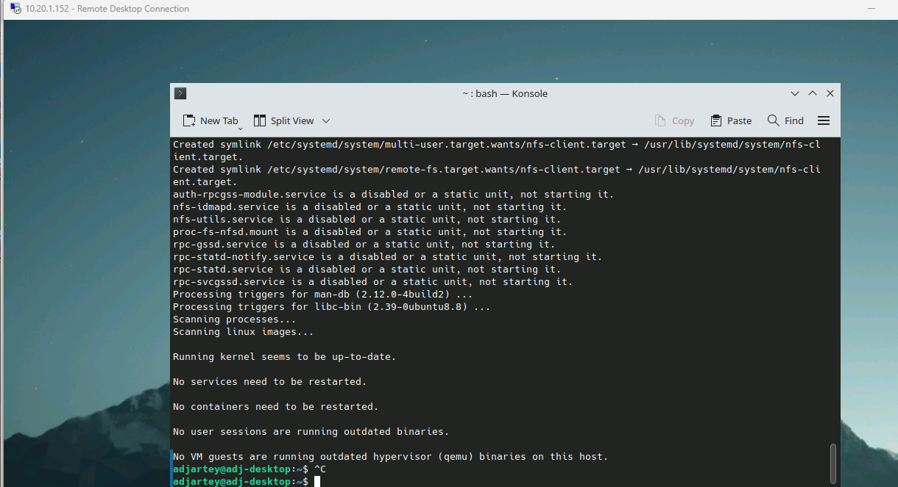
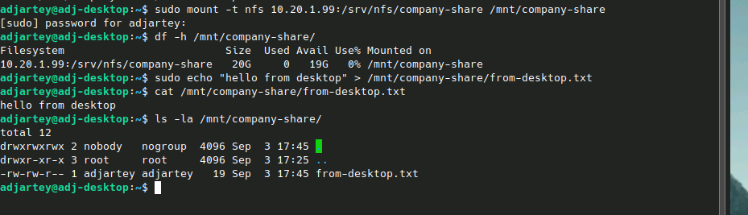
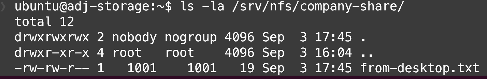
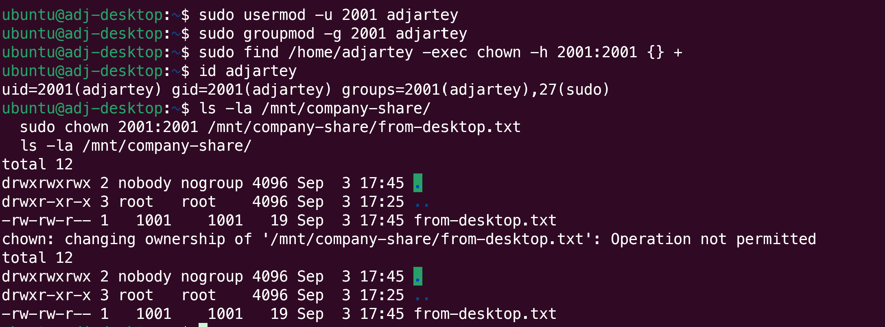
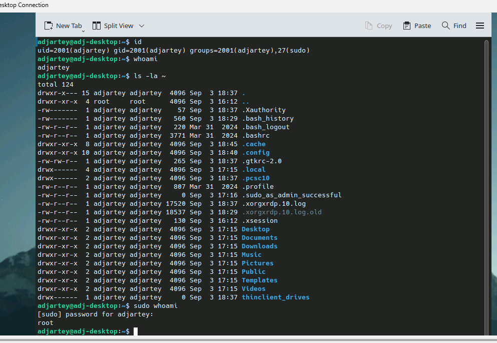
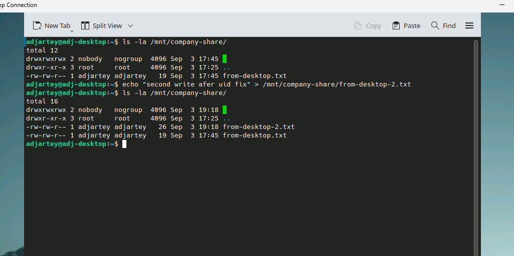
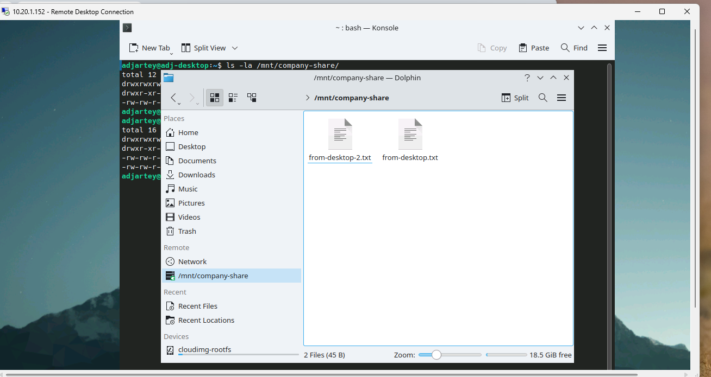

Mount the file share from [Deploy Private Shared Storage](/tutorials/deploy-private-shared-storage)
on the desktop from [Deploy Ubuntu Employee Desktops](/tutorials/deploy-ubuntu-employee-desktops),
so the employee has a persistent, shared place for company files that survives VM rebuilds and isn't
tied to any one desktop.

About 15 minutes per desktop.

:::note

By default this is a trusted, team-wide share, not per-employee isolated storage. Step 3 explains
why, and shows a real fix if your organization needs actual per-employee isolation.

:::

## Before you start

- [Deploy Private Shared Storage on ZCP](/tutorials/deploy-private-shared-storage) complete: an NFS
  share up and reachable over the tier
- [Deploy Ubuntu Employee Desktops on ZCP](/tutorials/deploy-ubuntu-employee-desktops) complete: a
  desktop VM, RDP-reachable, with its named employee user
- The storage VM's tier IP and export path from that tutorial

## Step 1: Install the NFS client on the desktop

Every command in this tutorial runs inside the RDP session on the desktop VM, not on the storage VM,
and not on your own local machine. Connect over RDP as in the previous tutorial, open a terminal
inside the desktop (Konsole, from the KDE application launcher), and run everything below there.

`nfs-common` is not present by default on the `ubuntukde` template:

```bash
sudo apt-get update && sudo apt-get install -y nfs-common
```



:::note

Unlike the `ubuntu` default user on the network and storage tutorials' infrastructure VMs
(passwordless `sudo`, standard for cloud-init default users), the desktop's named employee user
requires a password for `sudo`. This is expected and correct for a real desktop user, just worth
knowing so it doesn't look like something's broken when a password prompt appears here and didn't in
earlier tutorials.

:::

## Step 2: Mount the share

```bash
sudo mkdir -p /mnt/company-share
sudo mount -t nfs <storage-vm-tier-ip>:/srv/nfs/company-share /mnt/company-share
```

:::caution

Type or paste this as two clearly separate arguments: the NFS source and the local mount point. Some
terminals drop the space between them on paste, merging both into one path
(`.../company-share/mnt/company-share`). `mount` then fails with "can't find in /etc/fstab" instead
of a clear error, and `/mnt/company-share` silently stays as your local root disk. If writes to it
fail with "Permission denied" right after mounting, check `df -h /mnt/company-share` first. If it
shows your local disk instead of the NFS source, the mount never actually happened.

:::

Verify it worked and that you can actually use it:

```bash
df -h /mnt/company-share
echo "hello from desktop" > /mnt/company-share/from-desktop.txt
cat /mnt/company-share/from-desktop.txt
ls -la /mnt/company-share/
```



For a persistent mount across reboots, add it to `/etc/fstab`:

```bash
<storage-vm-tier-ip>:/srv/nfs/company-share /mnt/company-share nfs defaults,noatime 0 0
```

:::note

A systemd automount unit is a more resilient alternative, since it avoids a boot hang if the storage
VM is briefly unreachable, but it adds complexity. The plain `fstab` entry above is the recommended
default, matching the storage VM's own approach in the previous tutorial.

:::

## Step 3: UID and GID mapping

Read this before treating this tutorial as done. NFS, as configured in the storage tutorial, does
raw UID-number mapping, not username mapping. There is no identity system involved. See it yourself,
from the storage VM:

```bash
# on the storage VM, via SSH:
ls -la /srv/nfs/company-share/
```



A file written by the desktop's employee user shows correctly by name when viewed from that same
desktop, but shows as a bare number when viewed from the storage server or any other machine, since
no local user with that UID exists there. That part is harmless, just cosmetic.

The real issue: `useradd`, used by the `ubuntukde` template's first-boot script, assigns sequential
UIDs starting at 1000, and each desktop VM only ever creates one custom employee user. Every
employee's desktop user will almost certainly get the same UID (typically `1001`), regardless of
username. On the shared NFS mount, Unix permissions are enforced by UID number, not by name, so
every employee's desktop user is, as far as the filesystem is concerned, the same identity by
default. Any employee can read or write any other employee's files there.

:::note

The simplest option is to accept this and treat the share as a trusted, team-wide area rather than
per-employee isolated storage, stated plainly rather than implying isolation it doesn't have. Skip
straight to Step 4 if that's sufficient for your organization.

:::

### Giving each employee a real, unique identity

`ubuntukde` doesn't support setting an explicit UID at deploy time, but Linux lets you reassign one
after the fact with `usermod`. This works, with two real constraints worth knowing before relying on
it.

Pick a genuinely unique value per employee across your whole fleet. The number below is an example,
not a fixed convention:

```bash
sudo usermod -u 2001 jane.doe
sudo groupmod -g 2001 jane.doe
sudo find /home/jane.doe -exec chown -h 2001:2001 {} +
id jane.doe
```

:::caution

**This only works before the employee's first login.** `usermod` refuses to change a UID while any
process owned by that user is running, and a logged-in desktop session is a lot of processes (KDE,
xrdp, the shell, all of it):

```
usermod: user adjartey is currently used by process 2357
```

**Closing the RDP client window does not end the session.** This is a real gotcha, not a guess:
closing the window and reconnecting later showed every process still running, identical PIDs. The
session and everything in it stays alive on the server; only the display connection drops. To
actually end it:

```bash
sudo loginctl terminate-user jane.doe
```

Only once that returns no running processes for the user does `usermod` succeed:

```
ubuntu@adj-desktop:~$ sudo usermod -u 2001 adjartey
ubuntu@adj-desktop:~$ sudo groupmod -g 2001 adjartey
ubuntu@adj-desktop:~$ sudo find /home/adjartey -exec chown -h 2001:2001 {} +
ubuntu@adj-desktop:~$ id adjartey
uid=2001(adjartey) gid=2001(adjartey) groups=2001(adjartey),27(sudo)
```

:::



Log back in over RDP and confirm nothing broke, using the same username and password as before. Home
directory and `sudo` both stay intact:



:::caution

**Files written before the fix don't get fixed by `chown` from the desktop.** The export uses
`root_squash`, which strips root's power over the share specifically to stop a compromised client
from claiming root privileges on shared storage. That's exactly what blocks a client-side
retroactive fix too:

```
$ sudo chown 2001:2001 /mnt/company-share/from-desktop.txt
chown: changing ownership of '/mnt/company-share/from-desktop.txt': Operation not permitted
```

Run the same `chown` from the **storage VM's own local filesystem** instead, where `root_squash`
doesn't apply since it's not a remote client request:

```bash
# on the storage VM, via SSH:
sudo chown 2001:2001 /srv/nfs/company-share/from-desktop.txt
```

Anything written _after_ the UID fix gets the correct owner automatically, with no extra step.

:::



## Step 4: Confirm it's visible in the KDE desktop environment

The mounted share appears automatically in Dolphin, the KDE file manager, under **Places → Remote**
rather than Devices. No manual bookmarking is needed.



## Step 5: Repeat for each employee desktop

Once mounted and verified, this becomes a step in the standard onboarding flow. If you're using the
unique-UID approach from Step 3, track which UID belongs to which employee somewhere durable.
There's no template-level bookkeeping for this, it's on you to avoid reusing a value.

## Clean up

```bash
sudo umount /mnt/company-share
```

Remove the `fstab` entry only if tearing down a test desktop. In normal operation this mount is
meant to be permanent.

## Recap

```bash
sudo apt-get install -y nfs-common
sudo mkdir -p /mnt/company-share
sudo mount -t nfs <storage-vm-tier-ip>:/srv/nfs/company-share /mnt/company-share
# add to /etc/fstab for persistence

# default: trusted team-wide share, no further action

# for real per-employee isolation, before the employee's first login only:
sudo loginctl terminate-user <employee> # if a session already started
sudo usermod -u <unique-uid> <employee> && sudo groupmod -g <unique-uid> <employee>
sudo find /home/<employee> -exec chown -h <unique-uid>:<unique-uid> {} +
# fix any already-written files from the storage VM directly, not the desktop:
# root_squash blocks a client-side retroactive chown
```

## Next steps

The rest of this series (making it operational for a team) is still in progress. In the meantime:

- [Deploy Private Shared Storage on ZCP](/tutorials/deploy-private-shared-storage): the share this
  tutorial mounts
- [Deploy Ubuntu Employee Desktops on ZCP](/tutorials/deploy-ubuntu-employee-desktops): the desktop
  this tutorial connects
- [Tutorials overview](/tutorials): the full list of available tutorials
