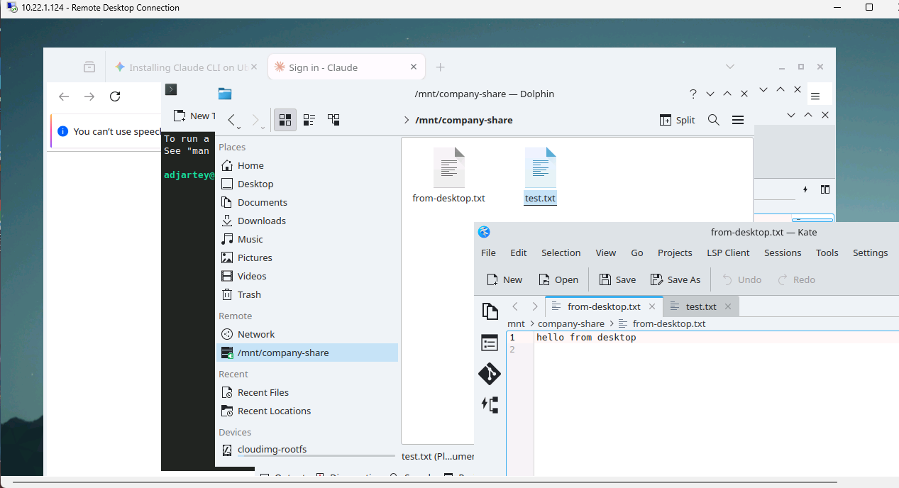

Mount the file share from [Deploy Private Shared Storage](/tutorials/deploy-private-shared-storage)
on the desktop from [Deploy Ubuntu Employee Desktops](/tutorials/deploy-ubuntu-employee-desktops),
so the employee has a persistent, shared place for company files that survives VM rebuilds and isn't
tied to any one desktop.

About 10 minutes per desktop.

:::note

This is a trusted, team-wide share, not per-employee isolated storage. See Step 3.

:::

## Before you start

- The NFS share from the storage tutorial, up and reachable
- The desktop from the previous tutorial, RDP-reachable, with its named employee user
- The share's tier IP and export path from the storage tutorial

## Step 1: Install the NFS client on the desktop

Every command in this tutorial runs inside the RDP session on the desktop VM, not on the network or
storage tutorials' infrastructure VMs, and not on your own local machine. Connect over RDP as in the
previous tutorial, open a terminal inside the desktop (Konsole, from the KDE application launcher),
and run everything below there.

`nfs-common` is not present by default on the `ubuntukde` template:

```bash
sudo apt-get update && sudo apt-get install -y nfs-common
```

:::note

Unlike the `ubuntu` default user on the network and storage tutorials' infrastructure VMs
(passwordless `sudo`, standard for cloud-init default users), the desktop's named employee user
requires a password for `sudo`. This is expected and correct for a real desktop user, just worth
knowing so it doesn't look like something's broken when a password prompt appears here and didn't in
earlier tutorials.

:::

## Step 2: Mount the share

```bash
sudo mkdir -p /mnt/company-share
sudo mount -t nfs <storage-vm-tier-ip>:/srv/nfs/company-share /mnt/company-share
```

Verify it worked and that you can actually use it:

```bash
df -h /mnt/company-share
echo "hello from desktop" > /mnt/company-share/from-desktop.txt
cat /mnt/company-share/from-desktop.txt
ls -la /mnt/company-share/
```

For a persistent mount across reboots, add it to `/etc/fstab`:

```bash
<storage-vm-tier-ip>:/srv/nfs/company-share /mnt/company-share nfs defaults,noatime 0 0
```

:::note

A systemd automount unit is a more resilient alternative, since it avoids a boot hang if the storage
VM is briefly unreachable, but it adds complexity. The plain `fstab` entry above is the recommended
default, matching the storage VM's own approach in the previous tutorial.

:::

## Step 3: UID and GID mapping

Read this before treating this tutorial as done. NFS, as configured in the storage tutorial, does
raw UID-number mapping, not username mapping. There is no identity system involved. See it yourself:

```bash
# on the desktop:
id
ls -la /mnt/company-share/

# on the storage VM, via SSH:
ls -la /srv/nfs/company-share/
id <the-desktop-uid-you-saw-above>
```

A file written by the desktop's employee user shows correctly by name when viewed from that same
desktop, but shows as a bare number when viewed from the storage server or any other machine, since
no local user with that UID exists there. That part is harmless, just cosmetic.

The real issue: `useradd`, used by the `ubuntukde` template's first-boot script, assigns sequential
UIDs starting at 1000, and each desktop VM only ever creates one custom employee user. Every
employee's desktop user will almost certainly get the same UID, regardless of username. On the
shared NFS mount, Unix permissions are enforced by UID number, not by name, so every employee's
desktop user is, as far as the filesystem is concerned, the same identity. There is no per-employee
file isolation on this share. Any employee can read or write any other employee's files there.

:::note

This tutorial treats the share as a trusted, team-wide area rather than per-employee isolated
storage, and states that plainly rather than implying isolation it doesn't have. If your
organization needs real employee-to-employee file privacy on shared storage, this pattern is not
sufficient on its own. Getting real isolation would mean either assigning explicit, tracked UIDs per
employee (the `ubuntukde` template doesn't support this yet) or adopting a real identity system such
as LDAP or SSSD across every desktop, both beyond the scope of this tutorial series.

:::

## Step 4: Confirm it's visible in the KDE desktop environment

The mounted share appears automatically in Dolphin, the KDE file manager, under **Places → Remote**
rather than Devices. No manual bookmarking is needed.



## Step 5: Repeat for each employee desktop

Once mounted and verified, this becomes a step in the standard onboarding flow. See
[Make it operational for a team](/tutorials/operate-workspace-for-a-team).

## Clean up

```bash
sudo umount /mnt/company-share
```

Remove the `fstab` entry only if tearing down a test desktop. In normal operation this mount is
meant to be permanent.

## Recap

```bash
sudo apt-get install -y nfs-common
sudo mkdir -p /mnt/company-share
sudo mount -t nfs <storage-vm-tier-ip>:/srv/nfs/company-share /mnt/company-share
# add to /etc/fstab for persistence
```

## Next steps

- [Make it operational for a team](/tutorials/operate-workspace-for-a-team): fold this into the
  onboarding checklist
