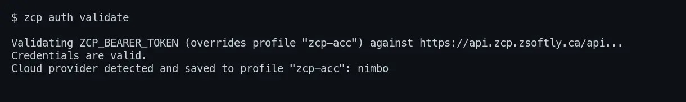
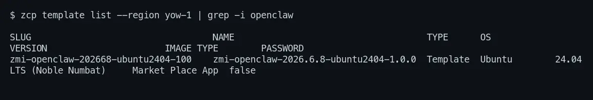
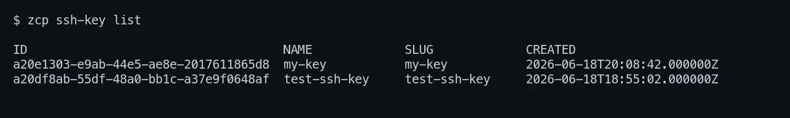
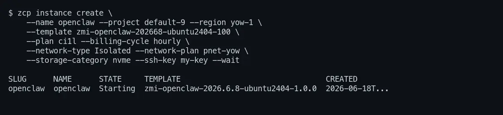
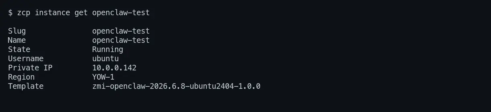
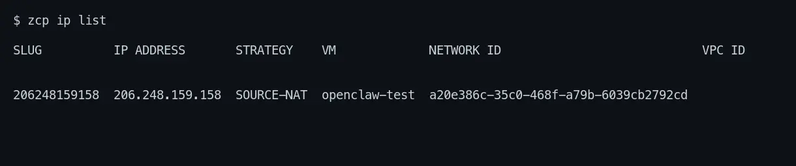
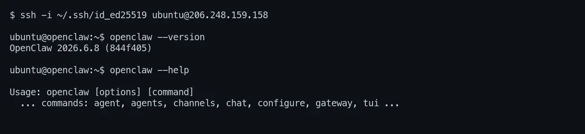

This tutorial takes you from a brand-new ZSoftly Public Cloud account to a running
[OpenClaw](https://openclaw.ai) instance, a self-hosted **personal AI assistant** that answers you
on the messaging channels you already use (WhatsApp, Telegram, Slack, Discord, and more). OpenClaw
ships as a **Marketplace app**, so it comes pre-installed on the image: you pick it as the template
and deploy. No manual install step. You do every step from your terminal with the `zcp` CLI.

By the end you have:

- An authenticated CLI on your machine
- A virtual machine with OpenClaw pre-installed, a public IP, and SSH access
- A path to configure the assistant and start chatting

Plan for about 10 minutes. Most of it is the VM booting.

:::note

The slugs in this tutorial (region `yow-1`, project `default-9`, the OpenClaw template, plans, and
so on) are **examples from one account**. Yours will differ. Every step shows the `list` command
that prints the right value for your account and region. Always use those, don't copy the examples
verbatim. OpenClaw is published in **both YOW and YUL**. Pick the region closest to you.

:::

## Before you start

- A ZSoftly Public Cloud account. [Sign up](/public-cloud/getting-started/account-signup) first if
  you do not have one.
- A terminal with an SSH client (Terminal on macOS or Linux, Windows Terminal or PowerShell on
  Windows).
- An SSH key pair. This tutorial creates one for you if you do not have it.
- For the configuration step at the end, an API key for a model provider (for example OpenAI or
  Anthropic). You can deploy and SSH in without one. You need it before the assistant can answer.

## Step 1: Install the CLI

The `zcp` CLI is a single binary. Install it with the one-line script.

```bash
# macOS and Linux
curl -fsSL https://raw.githubusercontent.com/zsoftly/zcp-cli/main/scripts/install.sh | bash
```

```powershell
# Windows (PowerShell)
irm https://raw.githubusercontent.com/zsoftly/zcp-cli/main/scripts/install.ps1 | iex
```

Confirm it works with `zcp version`. For other install methods, see the
[CLI installation guide](/public-cloud/cli/installation).

## Step 2: Authenticate

The CLI talks to the platform with a bearer token tied to your account.

1. In the portal, open **Profile → API Tokens** and create a token. Copy it.
2. Create a CLI profile and paste the token when prompted:

```bash
zcp profile add default
```

You are prompted for the **Bearer token** and the **API URL** (`https://api.zcp.zsoftly.ca/api`).
Then verify and let the CLI detect your cloud provider:

```bash
zcp auth validate
```



:::note

Every command that touches a region-specific resource requires a **region** and a **project**
(`--region`/`--project`, or the `ZCP_REGION`/`ZCP_PROJECT` environment variables). Set them once so
you don't repeat the flags. The commands below assume this:

```bash
export ZCP_REGION=yow-1        # see: zcp region list
export ZCP_PROJECT=default-9   # see: zcp project list (it's "default-9", not "default")
```

:::

## Step 3: Find the OpenClaw template

OpenClaw is a Marketplace app, which is just a template with the image type **Market Place App**.
List the templates for your region and filter for it:

```bash
zcp template list --region yow-1 | grep -i openclaw
```



Note the **SLUG** (for example `zmi-openclaw-202668-ubuntu2404-100`). The template slug differs by
region, so always take it from your own `template list`.

You also need a **project**, a **plan**, a **network plan**, and a **storage category**. List them
the same way:

```bash
zcp project list                  # note the SLUG, e.g. default-9 (not just "default")
zcp plan vm --region yow-1        # CPU/memory/price, e.g. ci1l
zcp plan network --region yow-1   # e.g. pnet-yow
zcp plan storage --region yow-1   # use a value from the STORAGE CATEGORY column, e.g. nvme
```

:::note

The project slug is **not** the word `default`. A new account's first project has a slug like
`default-9`. The storage category is region-specific (`nvme` in `yow-1`, while other regions may
expose `pro-nvme` or `premium-ssd`). Check the `list` output for your region.

:::

## Step 4: Add your SSH key

The OpenClaw image uses key-based login, not a password. If you do not have a key, create one:

```bash
ssh-keygen -t ed25519 -C "you@example.com"
```

Import the **public** key. `--project` and `--region` are required:

```bash
zcp ssh-key import \
  --name my-key \
  --key-file ~/.ssh/id_ed25519.pub \
  --project default-9 \
  --region yow-1

zcp ssh-key list
```



:::note

The key **name** must be 20 characters or fewer, and the public key itself must be unique.

:::

## Step 5: Deploy OpenClaw

Create the VM straight from the OpenClaw template. Because it is a Marketplace image, OpenClaw is
already installed. There is nothing to install over SSH afterward. `--storage-category` is required.

```bash
zcp instance create \
  --name openclaw \
  --project default-9 \
  --region yow-1 \
  --template zmi-openclaw-202668-ubuntu2404-100 \
  --plan ci1l \
  --billing-cycle hourly \
  --network-type Isolated \
  --network-plan pnet-yow \
  --storage-category nvme \
  --ssh-key my-key \
  --wait
```



`--wait` blocks until the VM reaches **Running**, usually one to three minutes.

## Step 6: Find the public IP and open SSH

Read the VM details for the login **Username** (the image logs in as `ubuntu`):

```bash
zcp instance get openclaw
```



:::note

`zcp instance get` leaves **Public IP** blank. The source-NAT public IP is listed by `zcp ip list`
instead.

:::

```bash
zcp ip list
```



Note the **IP ADDRESS** and the **SLUG** of the row whose `VM` is `openclaw`. The source-NAT IP
gives the VM outbound internet. Inbound is blocked until you open it. Open SSH (port `22`):

```bash
# Replace <ip-slug> with the SLUG from `zcp ip list`
zcp firewall create --ip <ip-slug> --protocol tcp --cidr 0.0.0.0/0 --start-port 22 --end-port 22
zcp portforward create --instance openclaw --ip <ip-slug> --protocol tcp \
  --public-port 22 --public-end-port 22 --private-port 22 --private-end-port 22
```

:::caution

`portforward create` requires the end-port flags (`--public-end-port` / `--private-end-port`) even
for a single port. For one port, set the end port equal to the start port.

:::

## Step 7: Connect and confirm OpenClaw is installed

```bash
ssh -i ~/.ssh/id_ed25519 ubuntu@<public-ip>
openclaw --version
```



You are on the VM with OpenClaw ready to configure.

:::note

`zcp instance ssh` resolves the VM's **private** IP first, so it only works from inside the network
(for example over a VPN). From a regular workstation, SSH to the **public** IP as shown above.

:::

## Step 8: Configure the assistant

OpenClaw ships a guided setup that walks you through credentials, your model provider, the gateway,
and messaging channels. Run it on the VM:

```bash
openclaw configure
```

Work through the prompts. At minimum add a **model provider** key so the assistant can answer. To
talk to it right away in a terminal UI over your SSH session:

```bash
openclaw chat
```

To run the always-on **gateway** (the control plane that channels connect to), start it and choose a
port and auth mode:

```bash
openclaw gateway --port 8080 --bind lan --auth token
```

If you expose the gateway to the internet, open that port the same way you opened `22` in Step 6,
and keep an auth mode set (never `none` on a public IP). OpenClaw's own
[docs](https://docs.openclaw.ai/start/getting-started) cover channels (WhatsApp, Telegram, Slack,
Discord, and more), the web Canvas, and skills.

:::caution

OpenClaw connects to your model provider and your messaging accounts. Treat the VM as sensitive:
keep the gateway behind an auth mode, and only open the ports you actually use.

:::

## Clean up

Hourly billing runs while resources exist. Remove them when you are done. Deleting the VM also
releases its source-NAT IP and the firewall and port-forward rules attached to it:

```bash
zcp instance delete openclaw
```

## Recap

The whole flow, start to finish (replace the example slugs with your own):

```bash
# 1. Authenticate
zcp profile add default
zcp auth validate

# 2. Find the OpenClaw template + your project/plan/storage
zcp template list --region yow-1 | grep -i openclaw
zcp project list
zcp plan vm --region yow-1 && zcp plan network --region yow-1 && zcp plan storage --region yow-1

# 3. Add your SSH key (project + region required)
zcp ssh-key import --name my-key --key-file ~/.ssh/id_ed25519.pub \
  --project default-9 --region yow-1

# 4. Deploy OpenClaw (pre-installed Marketplace image)
zcp instance create \
  --name openclaw --project default-9 --region yow-1 \
  --template zmi-openclaw-202668-ubuntu2404-100 --plan ci1l --billing-cycle hourly \
  --network-type Isolated --network-plan pnet-yow \
  --storage-category nvme --ssh-key my-key --wait

# 5. Open SSH, connect, and configure
zcp ip list
zcp firewall create --ip <ip-slug> --protocol tcp --cidr 0.0.0.0/0 --start-port 22 --end-port 22
zcp portforward create --instance openclaw --ip <ip-slug> --protocol tcp \
  --public-port 22 --public-end-port 22 --private-port 22 --private-end-port 22
ssh -i ~/.ssh/id_ed25519 ubuntu@<public-ip>
openclaw configure && openclaw chat
```

## Next steps

- [Deploy a VPS with Dokploy (CLI)](/tutorials/deploy-vps-dokploy-cli): a from-scratch VPS where you
  install the software yourself
- [CLI reference](/public-cloud/cli/reference): every command and flag
- [Connect via SSH](/public-cloud/compute/connect-ssh): key management and troubleshooting
- [Port forwarding](/public-cloud/compute/settings/port-forwarding): expose specific services
- [OpenClaw documentation](https://docs.openclaw.ai/start/getting-started): configure channels,
  skills, and the gateway
