An NFS file share running on a VM inside the private tier from
[Build a Private Network with Headscale](/tutorials/build-private-network-headscale), reachable only
from the mesh network that tutorial built, never exposed publicly.

Plan for about 20 minutes.

:::note

As in the previous tutorial, the slugs below are examples from one account. Yours will differ. Use
`list` commands to find your own.

:::

## Before you start

- [Build a Private Network with Headscale](/tutorials/build-private-network-headscale) complete: a
  VPC with a private tier, a Headscale server, and a subnet router already advertising and serving
  that tier's route.
- `ZCP_REGION` and `ZCP_PROJECT` still exported from the previous tutorial, or re-export them.

## Step 1: Deploy the storage VM

A VM with no public network footprint at all sounds like the most private option, but it creates a
real problem: you have no way to reach it, not even for the initial setup needed to bring the tier
network interface up. Deploy normally instead, so a public IP is allocated, then lock SSH down to
your own IP and never open the NFS ports on the public side at all. The VM ends up just as
unreachable for NFS from the outside as a no-public-IP VM would be. The public IP exists only for
tightly gated admin access.

```bash
zcp instance create --name my-storage \
  --template ubuntu-2404-lts-1 --plan ca2sxs --billing-cycle hourly \
  --network-plan pnet-yul --storage-category premium-ssd --ssh-key my-key --wait

zcp instance add-network my-storage --network workspace-tier
```

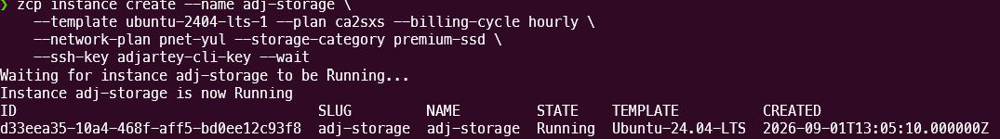

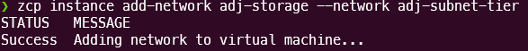

Attach a data disk, not the root disk, so storage growth and backups stay independent of the
operating system:

```bash
zcp volume create --name my-storage-data --billing-cycle hourly \
  --storage-category pro-nvme --size 20 --vm my-storage
```

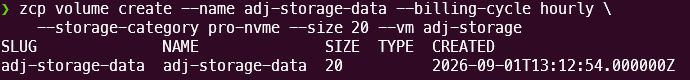

:::caution

`zcp volume create --plan b2g1` fails with a server error
(`API error 500: Undefined property: stdClass::$storage`). Use `--size <GB>` instead of `--plan`.

:::

Get the storage VM's IP slug and lock SSH down to your own IP:

```bash
zcp ip list   # find the row whose VM is my-storage
curl -s https://ifconfig.me   # your own public IP
```

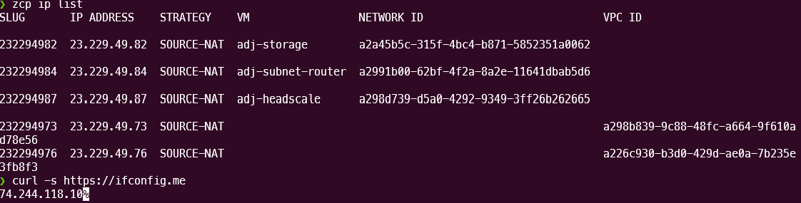

```bash
zcp firewall create --ip <ip-slug> --protocol tcp --start-port 22 \
  --end-port 22 --cidr <your-ip>/32
zcp portforward create --ip <ip-slug> --protocol tcp --public-port 22 \
  --public-end-port 22 --private-port 22 --private-end-port 22 \
  --instance my-storage
```

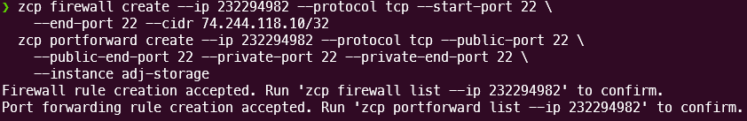

## Step 2: Bring up the tier network interface and format the data disk

Same pattern as the subnet router in the previous tutorial:

```bash
ssh ubuntu@<storage-vm-public-ip>

ip -br link show   # confirm ens8 shows DOWN
```

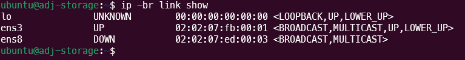

```bash
sudo tee /etc/netplan/60-tier-nic.yaml <<'EOF'
network:
  version: 2
  ethernets:
    ens8:
      dhcp4: true
EOF
sudo netplan apply
```

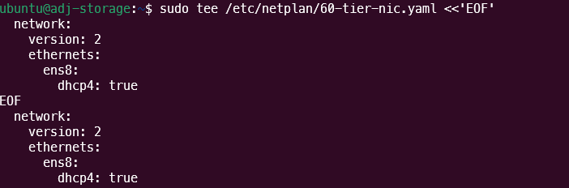

:::note

Netplan may warn that `/etc/netplan/60-tier-nic.yaml` has permissions that are "too open."
`sudo tee` creates the file world-readable by default. Harmless here, and the config still applies.

:::

```bash
ip -4 -br addr show   # confirm ens8 has a 10.20.1.x address and note it for Step 5
```

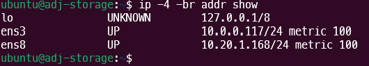

Confirm the data disk, format it, and mount it:

```bash
lsblk   # confirm the second disk, e.g. vdb
```

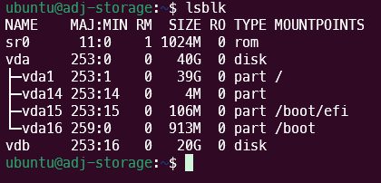

```bash
sudo mkfs.ext4 -F /dev/vdb
sudo mkdir -p /srv/nfs
sudo mount /dev/vdb /srv/nfs
sudo mkdir -p /srv/nfs/company-share
echo '/dev/vdb /srv/nfs ext4 defaults,noatime 0 2' | sudo tee -a /etc/fstab
```

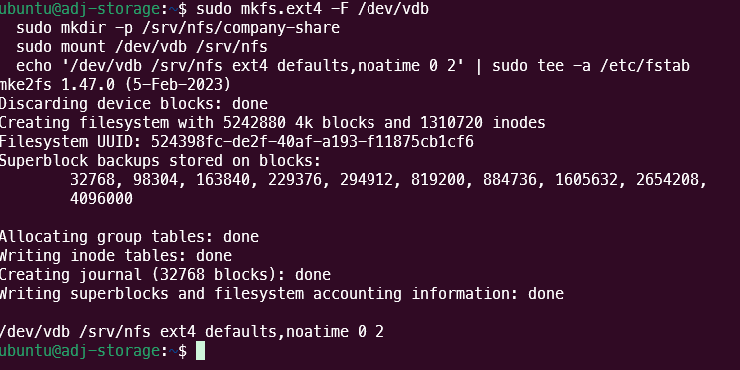

:::caution

Double-check the device name before formatting. A wrong device means data loss on whatever else was
there.

Create `company-share` after mounting, not before. A directory created before the mount lands on the
root disk and gets hidden the moment something else is mounted on top of it.

:::

## Step 3: Install and export NFS

```bash
sudo apt-get update && sudo apt-get install -y nfs-kernel-server
sudo chown nobody:nogroup /srv/nfs/company-share
sudo chmod 0777 /srv/nfs/company-share
```

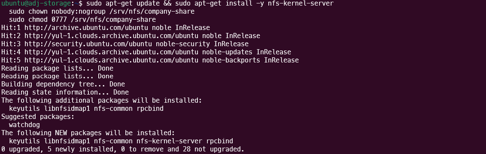

Export it, scoped to who's actually allowed to mount it:

```bash
sudo tee /etc/exports > /dev/null <<'EOF'
/srv/nfs/company-share 10.20.1.0/24(rw,sync,no_subtree_check,root_squash) \
100.64.0.0/10(rw,sync,no_subtree_check,root_squash)
EOF

sudo exportfs -ra
sudo exportfs -v
```

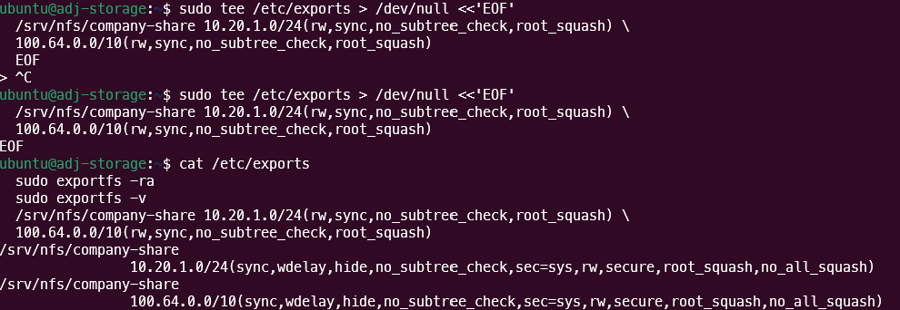

:::note

Paste this as a single very long line instead of the heredoc above and some terminals will silently
break it across two lines on paste, which `exportfs` then reads as two malformed entries. The
heredoc with a trailing `\` for line continuation avoids that.

:::

:::caution

Scope the export to **both** the tier's own CIDR and the Headscale range, not just one. A VM
physically on the tier connects with a tier-address source. An employee connecting over Tailscale
from anywhere else, the scenario this whole series is built for, arrives with a Headscale-range
source (`100.64.0.0/10`), forwarded by the subnet router with the original address preserved, not
rewritten. Exporting to only one range locks out the other.

:::

:::note

`root_squash` (used above) is the safer default. Root on a client machine does not get
root-equivalent access to the share. `no_root_squash` is available if you specifically need it, but
understand the tradeoff before using it.

:::

## Step 4: Open the firewall, scoped the same way

```bash
sudo ufw allow from 10.20.1.0/24 to any port 2049 proto tcp
sudo ufw allow from 10.20.1.0/24 to any port 111 proto tcp
sudo ufw allow from 10.20.1.0/24 to any port 20048 proto tcp
sudo ufw allow from 100.64.0.0/10 to any port 2049 proto tcp
sudo ufw allow from 100.64.0.0/10 to any port 111 proto tcp
sudo ufw allow from 100.64.0.0/10 to any port 20048 proto tcp
sudo ufw allow 22/tcp
sudo ufw --force enable
```

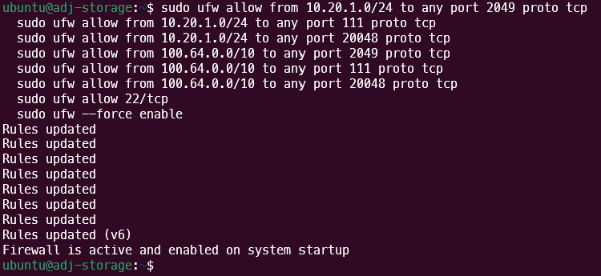

This is the VM's own operating-system firewall, separate from, and in addition to, the fact that no
firewall or port-forward rules exist for these ports on the storage VM's public IP at all. Both
layers matter. Neither alone is the whole story.

## Step 5: Verify from a mesh client

From any device already connected via Tailscale to the Headscale server from the previous tutorial,
not something physically on the tier. This is the scenario that matters:

```bash
sudo apt-get install -y nfs-common
sudo mkdir -p /mnt/company-share
sudo mount -t nfs <storage-vm-tier-ip>:/srv/nfs/company-share /mnt/company-share

echo "test" | sudo tee /mnt/company-share/test.txt
cat /mnt/company-share/test.txt
```

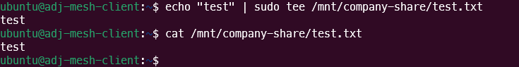

:::caution

If this hangs instead of failing cleanly, check `tailscale status` on both the client and the subnet
router before assuming anything about the NFS or firewall configuration is wrong. A node can
silently go offline (unable to reach the coordination server) with no obvious trigger.
`sudo systemctl restart tailscaled` on the affected node resolves it.

:::

## Step 6: Verify isolation

```bash
# from anywhere outside the mesh:
nc -zv -w 3 <storage-vm-public-ip> 2049
```

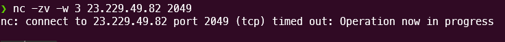

This fails (connection refused or timeout). The storage VM's public IP has SSH open and nothing
else. NFS is reachable exclusively through the private tier.

:::note

`nc` (`sudo apt-get install -y netcat-openbsd` if you don't have it) works the same way in any
shell. `/dev/tcp/<host>/<port>` is a bash-only feature and errors outright in shells like zsh.

:::

## Clean up

```bash
zcp instance delete my-storage
zcp volume delete my-storage-data
```

:::caution

Deleting the VM does not delete its data volume. It becomes orphaned, unattached, and still
billable. `zcp volume delete` is a required separate step, even though the volume was created with
`--vm` at creation time rather than standalone.

:::

## Recap

```bash
zcp instance create --template ubuntu-2404-lts-1 ... && zcp instance add-network ...
zcp volume create --size 20 ... --vm my-storage   # not --plan, see Step 1

zcp firewall create ... && zcp portforward create ...   # SSH only, port 22

# on the VM: netplan for the tier interface, format and mount the disk, install nfs-kernel-server
echo '<export-line-with-both-cidrs>' | sudo tee /etc/exports && sudo exportfs -ra
sudo ufw allow from <tier-cidr-and-headscale-range> to any port 2049,111,20048

# from a mesh client:
sudo mount -t nfs <storage-vm-tier-ip>:/srv/nfs/company-share /mnt/company-share
```

## Next steps

The next parts of this series (Ubuntu employee desktops, then connecting them to this share) are
still in progress. In the meantime:

- [Build a Private Network with Headscale](/tutorials/build-private-network-headscale): the tier and
  mesh this tutorial builds on
- [CLI reference](/public-cloud/cli/reference): every command and flag
- [Tutorials overview](/tutorials): the full list of available tutorials
