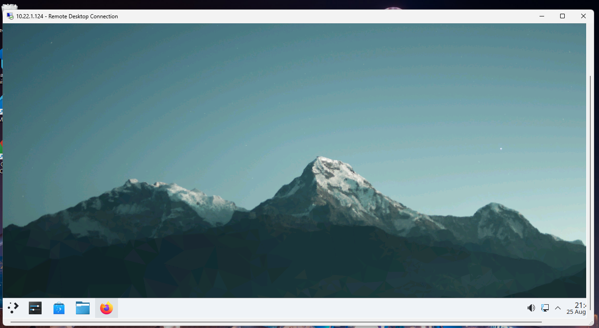
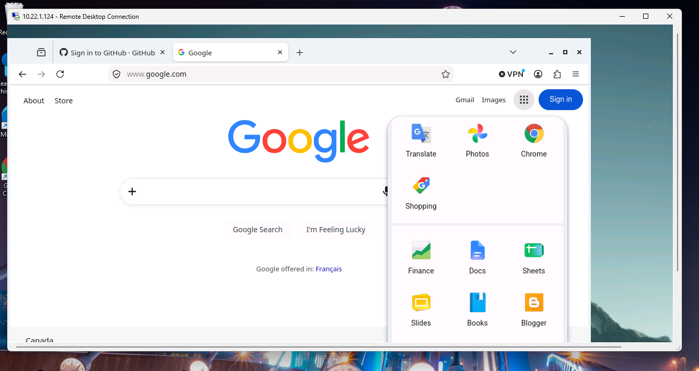
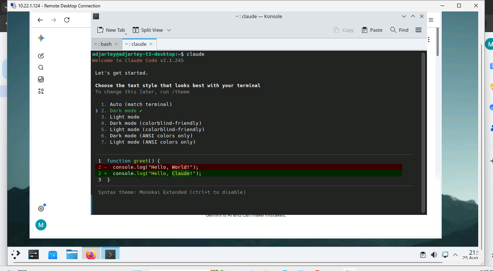

A full Ubuntu KDE desktop running inside the private tier from
[Build a Private Network with Headscale](/tutorials/build-private-network-headscale), reached only
through the mesh. No public IP, no port forwarding. It behaves like any other remote desktop once
connected.

Plan for about 20 minutes: image deploy plus first-boot KDE provisioning.

:::note

As in the previous tutorials, the slugs below are examples from one account. Yours will differ.

:::

## Before you start

- [Build a Private Network with Headscale](/tutorials/build-private-network-headscale) complete (at
  minimum. This tutorial doesn't depend on the storage tutorial).
- An RDP client: the built-in Remote Desktop Connection on Windows, Microsoft Remote Desktop from
  the macOS App Store, or Remmina or FreeRDP on Linux.

## Step 1: Find the ubuntukde template

```bash
zcp template list | grep -i ubuntukde
```

Note the SLUG and version. This tutorial was validated against `zmi-ubuntukde--ubuntu2404-1.0.2`,
which fixes a real bug: snap-confined apps such as Firefox and Chromium silently failing to launch
over RDP because of a missing environment variable. Confirm you're on 1.0.2 or later.

## Step 2: Provision a named user via cloud-init

Each employee gets their own login, not the template's generated default user. Write a small
cloud-config:

```bash
cat > deploy.env-userdata.yaml <<'EOF'
#cloud-config
write_files:
  - path: /etc/zmi/deploy.env
    content: |
      UBUNTUKDE_USERNAME=jane.doe
      UBUNTUKDE_PASSWORD=<a-real-password>
EOF
```

## Step 3: Deploy into your private tier

```bash
zcp instance create --name jane-doe-desktop \
  --template zmi-ubuntukde--ubuntu2404-1-0-2 --plan ci2lxl --billing-cycle hourly \
  --network-plan pnet-yul --is-public=false --storage-category premium-ssd \
  --user-data-file deploy.env-userdata.yaml --wait

zcp instance add-network jane-doe-desktop --network workspace-tier
```

:::note

4 vCPU / 16GB RAM (`ci2lxl` or equivalent) gives a genuinely smooth desktop experience. 4 vCPU/8GB
is usable but noticeably less responsive. Treat 16GB as the recommended baseline, not a hard
minimum.

:::

## Step 4: Connect over RDP

No public IP, no port forwarding. Access is purely through the mesh, the same way the subnet router
and storage VM are reached:

- Address: the desktop's private tier IP (for example `10.22.1.124`)
- Username and password: whatever was set in Step 2



:::note

If everything looks tiny despite the RDP window filling the screen, set an explicit resolution in
the RDP client rather than relying on auto-negotiation.

:::

## Step 5: Verify the desktop works end to end

Launch Firefox or Chromium from the KDE application launcher.



On any image older than 1.0.2, this step fails: the app flashes and closes immediately with no
window. A terminal session works the same way, confirming the desktop is a genuinely usable work
environment, not just a browser demo.



Confirm internet access works from inside the session too.

## Step 6: RDP performance tuning

The template disables the KWin compositor and sets a lower color depth by default. The compositor
fights RDP's non-GPU rendering path, and a lower color depth cuts bandwidth. No action needed here.
This is context for why the default experience is already tuned, not a step to perform.

## Step 7: A note on video conferencing

xrdp in this template has no H.264/AVC444 support, only RFX and raw-bitmap encoding, which is fine
for a static desktop and performs poorly for continuously-changing video content. Zoom, Zoho Meet,
and similar apps run poorly _inside_ the session as a result.

The recommended pattern: run the call app locally on the employee's own machine, and screen-share
the RDP client window instead. This is standard practice for RDP and VDI environments generally, not
a workaround unique to this template.

## Clean up

```bash
zcp instance delete jane-doe-desktop
```

## Recap

```bash
zcp template list | grep -i ubuntukde
# write deploy.env userdata with UBUNTUKDE_USERNAME/UBUNTUKDE_PASSWORD

zcp instance create --template zmi-ubuntukde--ubuntu2404-1-0-2 \
  --network-plan pnet-yul --is-public=false --user-data-file deploy.env-userdata.yaml ...
zcp instance add-network <vm> --network workspace-tier

# RDP to the tier IP, verify Firefox or Chromium launch correctly
```

## Next steps

- [Connect desktops to company storage](/tutorials/connect-desktops-to-storage): mount the previous
  tutorial's file share on this desktop
- [Make it operational for a team](/tutorials/operate-workspace-for-a-team): turn this into a
  repeatable onboarding process
