A full Ubuntu KDE desktop running inside the private tier from
[Build a Private Network with Headscale](/tutorials/build-private-network-headscale), reached only
through the mesh. RDP is never exposed publicly. It behaves like any other remote desktop once
connected.

Plan for about 30 minutes: image deploy, first-boot KDE provisioning, and bringing up the tier
network interface.

:::note

As in the previous tutorials, the slugs below are examples from one account. Yours will differ.

:::

## Before you start

- [Build a Private Network with Headscale](/tutorials/build-private-network-headscale) complete (at
  minimum. This tutorial doesn't depend on the storage tutorial).
- Your SSH key already imported (from the first tutorial), for the one-time setup step below.
- An RDP client: the built-in Remote Desktop Connection on Windows, Microsoft Remote Desktop from
  the macOS App Store, or Remmina or FreeRDP on Linux.

## Step 1: Find the ubuntukde template

```bash
zcp template list | grep -i ubuntukde
```

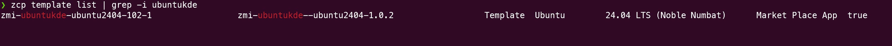

Note the SLUG and version. This tutorial was validated against version `1.0.2`, which fixes a real
bug: snap-confined apps such as Firefox and Chromium silently failing to launch over RDP because of
a missing environment variable. Confirm you're on 1.0.2 or later.

## Step 2: Provision a named user via cloud-init

Each employee gets their own login, not the template's generated default user. Write a small
cloud-config:

```bash
cat > deploy.env-userdata.yaml <<'EOF'
#cloud-config
write_files:
  - path: /etc/zmi/deploy.env
    content: |
      UBUNTUKDE_USERNAME=jane.doe
      UBUNTUKDE_PASSWORD=<a-real-password>
EOF
```

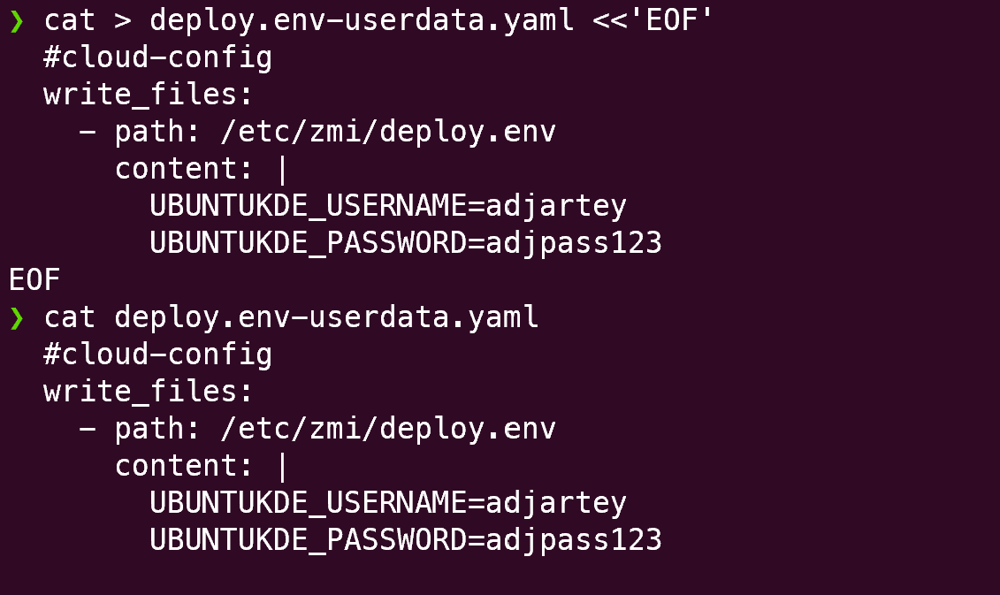

## Step 3: Deploy into your private tier

```bash
zcp instance create --name jane-doe-desktop \
  --template <ubuntukde-slug> --plan ci2lxl --billing-cycle hourly \
  --network-plan pnet-yul --storage-category premium-ssd --ssh-key my-key \
  --user-data-file deploy.env-userdata.yaml --wait
```

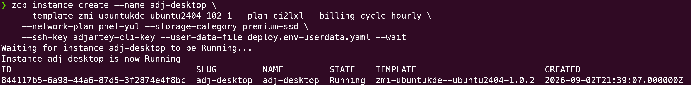

```bash
zcp instance add-network jane-doe-desktop --network workspace-tier
```

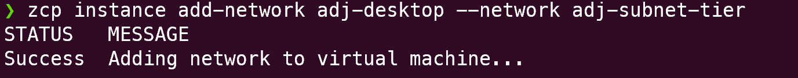

:::note

4 vCPU / 16GB RAM (`ci2lxl` or equivalent) gives a genuinely smooth desktop experience. 4 vCPU/8GB
is usable but noticeably less responsive. Treat 16GB as the recommended baseline, not a hard
minimum.

:::

:::caution

A public IP is deployed here deliberately, for the one-time setup in the next two steps. There's no
console/recovery access on this platform, and the tier network interface below needs manual
configuration the same way it did in the previous tutorials. With no public IP at all, a stuck
interface would be unrecoverable. The public IP gets locked down to nothing but SSH from your own
address in Step 6, and RDP never touches it at any point; the desktop is reached exclusively through
the tier.

:::

## Step 4: Bring up the tier network interface

Same pattern as the subnet router and storage VM in the earlier tutorials: the platform hot-adds the
second interface, but the guest OS doesn't bring it up automatically.

```bash
ssh ubuntu@<desktop-public-ip>

ip -br link show   # confirm ens8 shows DOWN
```

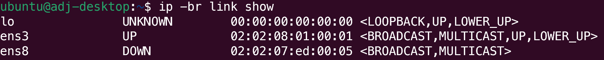

```bash
sudo tee /etc/netplan/60-tier-nic.yaml <<'EOF'
network:
  version: 2
  ethernets:
    ens8:
      dhcp4: true
EOF
```

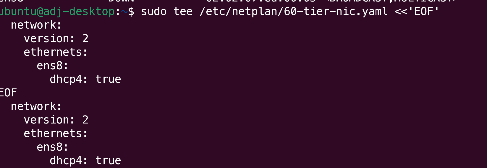

```bash
sudo netplan apply
```

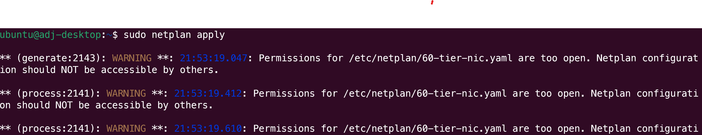

:::note

Netplan may warn that `/etc/netplan/60-tier-nic.yaml` has permissions that are "too open."
`sudo tee` creates the file world-readable by default. Harmless here, and the config still applies.

:::

```bash
ip -4 -br addr show   # confirm ens8 has a 10.x.x.x tier address, note it for Step 7
```

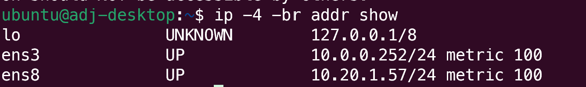

:::note

Confirm the cloud-init user from Step 2 actually exists while you're in here:

```bash
getent passwd jane.doe
```

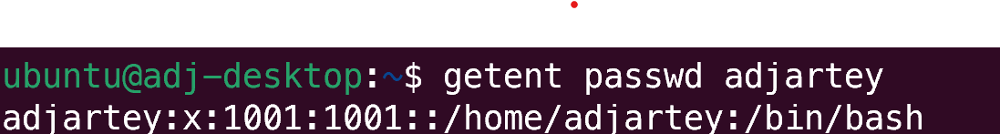

It's independent of the network fix above, worth checking once rather than discovering a typo only
after trying to RDP in.

:::

## Step 5: Decide how this desktop's identity works on shared storage

Only relevant if you plan to also mount private shared storage on this desktop, but this is the only
point where it's cheap and safe to act on: right now, before the employee's first login.

NFS, if you use it, does raw UID-number mapping, not username mapping. `useradd`, used by this
template's first-boot script, assigns sequential UIDs starting at 1000, and each desktop VM only
ever creates one custom employee user, so every employee's desktop user will almost certainly get
the same UID (typically `1001`), regardless of username. On shared storage, that means every
employee's desktop user is, by default, the same identity as far as the filesystem is concerned.

:::note

**Default: accept it.** If you're not using shared storage, or a trusted team-wide share is fine for
your organization, no action needed. Skip straight to Step 6.

:::

### Advanced: giving this employee a real, unique identity

Linux lets you reassign the UID with `usermod`, as long as it happens before the employee's first
login. You're already in the right session for it, still connected as `ubuntu` from Step 4, and
nobody has ever logged in as the employee yet. Pick a genuinely unique value per employee across
your whole fleet:

```bash
sudo usermod -u 2001 jane.doe
sudo groupmod -g 2001 jane.doe
sudo find /home/jane.doe -exec chown -h 2001:2001 {} +
id jane.doe
```

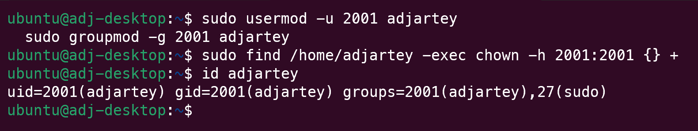

Now the employee can log in for the first time with the reassigned identity already in place:

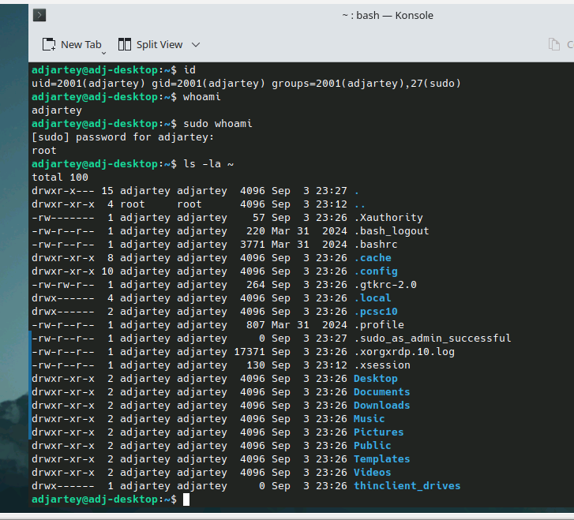

:::note

Track which UID belongs to which employee somewhere durable once you start doing this across a
fleet. There's no template-level bookkeeping for it, it's on you to avoid reusing a value.

If a desktop's employee has already logged in at least once before you got to this step, `usermod`
refuses while their session is active, and closing the RDP client does not end it. The
Troubleshooting section of the private-storage tutorial in this series has the recovery path for
that case.

:::

## Step 6: Lock down the default SSH rule

```bash
zcp firewall list --ip <ip-slug>
```

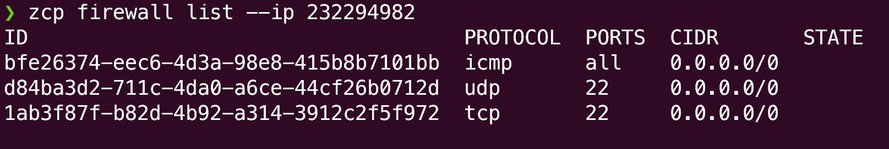

:::caution

Marketplace App templates like this one get a default SSH firewall rule at deploy time, open to
**any address** (`0.0.0.0/0`, both TCP and UDP port 22). Not something you created, and not scoped
to you. Lock it down:

```bash
zcp portforward list --ip <ip-slug>   # the matching port-forward rules are fine, no change needed
```

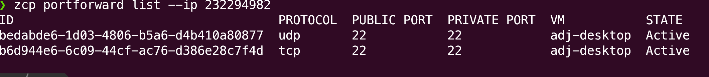

A port-forward rule without a matching firewall rule routes nothing. The firewall is the actual
gate, so tightening it is enough. Nothing to change here.

```bash
zcp firewall delete <ssh-tcp-rule-id> --ip <ip-slug> --yes
zcp firewall delete <ssh-udp-rule-id> --ip <ip-slug> --yes
```

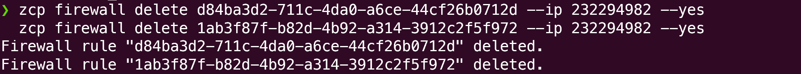

```bash
zcp firewall create --ip <ip-slug> --protocol tcp --start-port 22 \
  --end-port 22 --cidr <your-own-public-ip>/32
```

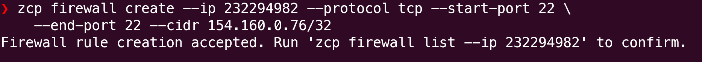

```bash
zcp firewall list --ip <ip-slug>   # confirm SSH is now scoped to just your IP
```

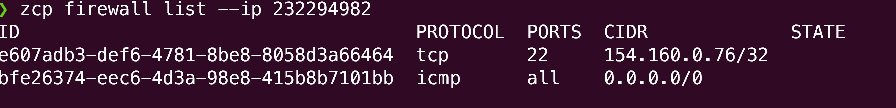

:::

## Step 7: Connect over RDP

Connect to the desktop's **tier** IP from Step 4, not the public IP. RDP was never opened on the
public side at all, only SSH, and that's locked to you alone:

- Address: the tier IP noted in Step 4 (for example `10.20.1.57`)
- Username and password: whatever was set in Step 2

:::note

If everything looks tiny despite the RDP window filling the screen, set an explicit resolution in
the RDP client rather than relying on auto-negotiation.

:::

## Step 8: Verify the desktop works end to end

Launch Firefox or Chromium from the KDE application launcher. On any image older than 1.0.2, this
step fails: the app flashes and closes immediately with no window. Open a terminal too, the same
way, confirming the desktop is a genuinely usable work environment, not just a browser demo.

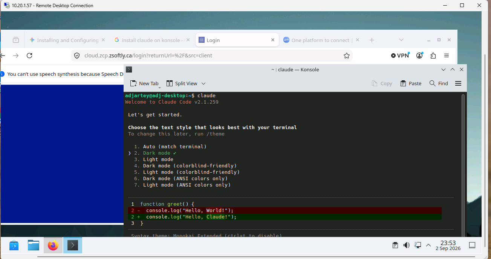

Confirm internet access works from inside the session too.

## Step 9: RDP performance tuning

The template disables the KWin compositor and sets a lower color depth by default. The compositor
fights RDP's non-GPU rendering path, and a lower color depth cuts bandwidth. No action needed here.
This is context for why the default experience is already tuned, not a step to perform.

## Step 10: A note on video conferencing

xrdp in this template has no H.264/AVC444 support, only RFX and raw-bitmap encoding, which is fine
for a static desktop and performs poorly for continuously-changing video content. Zoom, Zoho Meet,
and similar apps run poorly _inside_ the session as a result.

The recommended pattern: run the call app locally on the employee's own machine, and screen-share
the RDP client window instead. This is standard practice for RDP and VDI environments generally, not
a workaround unique to this template.

## Clean up

```bash
zcp instance delete jane-doe-desktop
```

## Recap

```bash
zcp template list | grep -i ubuntukde
# write deploy.env userdata with UBUNTUKDE_USERNAME/UBUNTUKDE_PASSWORD

zcp instance create --template <ubuntukde-slug> --plan ci2lxl \
  --network-plan pnet-yul --ssh-key my-key --user-data-file deploy.env-userdata.yaml ...
zcp instance add-network <vm> --network workspace-tier

# on the VM: netplan for the tier interface (same as Tutorials 1 and 2), confirm the
# cloud-init user exists with getent passwd

# if using shared storage, decide identity now, before first login:
#   sudo usermod -u <unique-uid> <employee> && sudo groupmod -g <unique-uid> <employee>
#   sudo find /home/<employee> -exec chown -h <unique-uid>:<unique-uid> {} +

# lock down the default open SSH rule this template creates: delete tcp+udp 22 on
# 0.0.0.0/0, replace with tcp 22 scoped to your own IP
zcp firewall delete ... && zcp firewall create ...

# RDP to the tier IP, not the public IP, and verify Firefox or Chromium launch correctly
```

## Next steps

The rest of this series (private shared storage, connecting these desktops to it, then making it
operational for a team) is still in progress. In the meantime:

- [Build a Private Network with Headscale](/tutorials/build-private-network-headscale): the tier and
  mesh this tutorial builds on
- [CLI reference](/public-cloud/cli/reference): every command and flag
- [Tutorials overview](/tutorials): the full list of available tutorials
